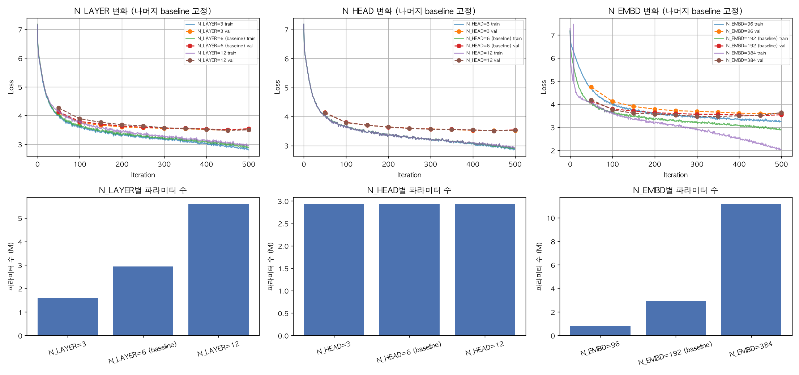
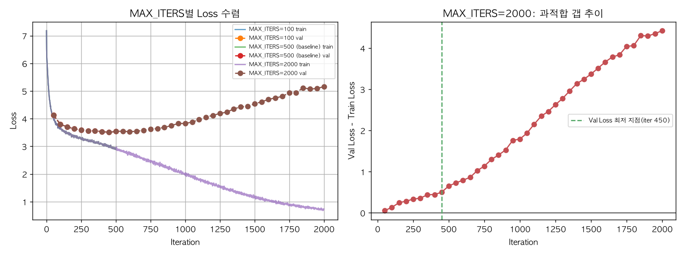
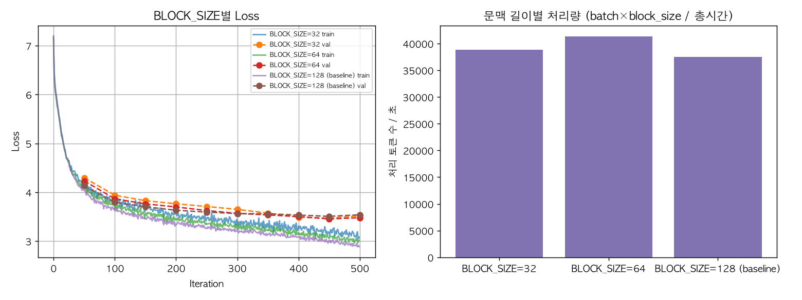
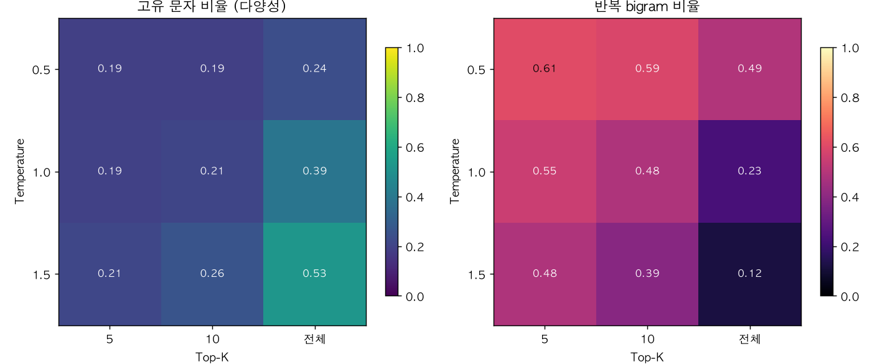
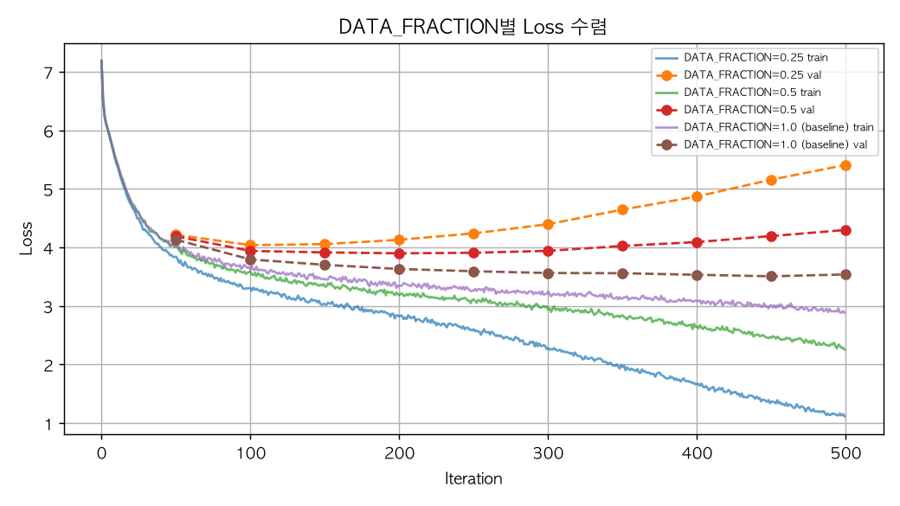
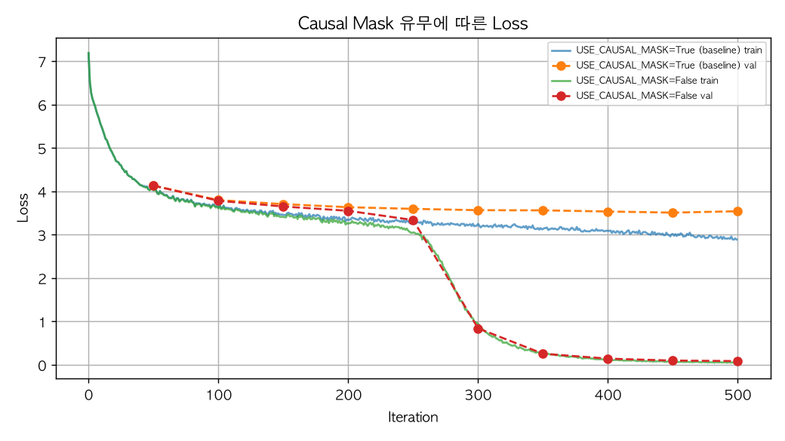
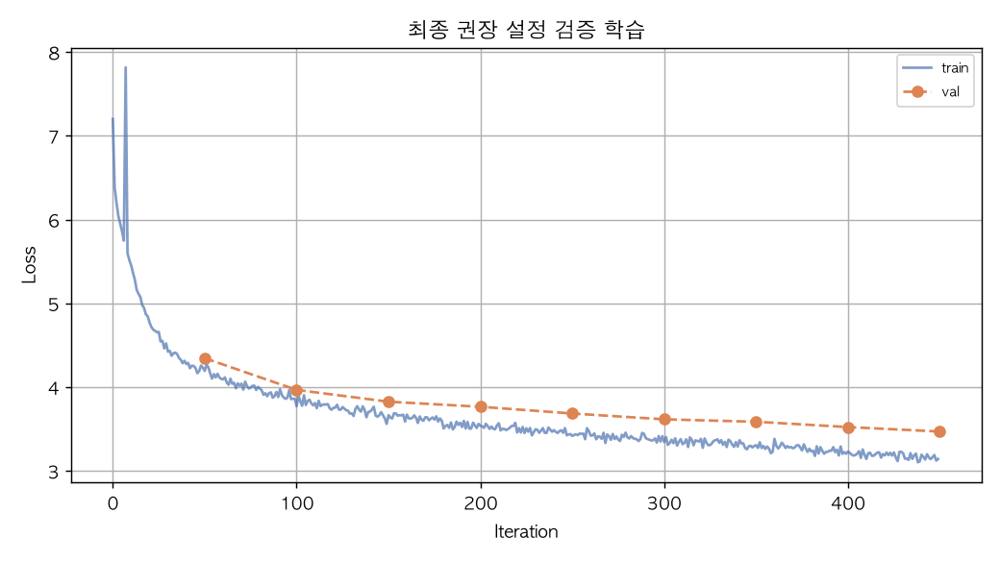

# 🚀 GPT 하이퍼파라미터 및 구조 실험 종합 보고서

## 1. 개요 및 실험 환경

- **실험 목적:** 문자 단위 charGPT(minGPT 교육용 축소판)를 사용해, 모델 크기·학습 반복 수·문맥 길이·생성 파라미터·데이터 양·Causal Mask 유무가 학습/생성 품질에 미치는 영향을 정량(Train/Val Loss, Perplexity)·정성(생성문 원문) 양쪽에서 확인한다.
- **실행 환경:** PyTorch 2.13.0, device=mps (Apple Silicon GPU/MPS 사용, 미가용 시 CPU로 자동 전환)
- **통제 변수:** 매 조건 학습 전 `set_seed(3407)` 고정, 생성 비교는 항상 동일한 시작 문맥 `text[:16]` 사용, corpus 뒤쪽 10%를 모든 실험 공통의 held-out 검증셋으로 고정(train 90% / val 10%, DATA_FRACTION은 train 90% 안에서만 적용해 val 누수 방지). 각 실험은 baseline(N_LAYER=6, N_HEAD=6, N_EMBD=192, MAX_ITERS=500, BLOCK_SIZE=128, TEMPERATURE=1.0, TOP_K=10, DATA_FRACTION=1.0, USE_CAUSAL_MASK=True)에서 비교 대상 변수 1개만 바꿔 실행했다. 특히 2.1(모델 크기)은 N_LAYER/N_HEAD/N_EMBD를 동시에 바꾸지 않고, baseline에서 한 파라미터씩만 올리고 내려 완전히 독립적으로 비교했다(각 소절 안에서만 비교하며, 서로 다른 파라미터 간에는 직접 비교하지 않음).
- **데이터셋:** 김유정 단편 corpus(위키문헌 퍼블릭 도메인), 전체 97,709자 / train_raw 87,938자 / val(held-out, 고정) 9,771자, vocab 크기 1272자(고유 문자 수).

## 2. 실험 결과 및 상세 분석

### 2.1 모델 크기 — N_LAYER / N_HEAD / N_EMBD 각각 독립적으로 비교

baseline(N_LAYER=6, N_HEAD=6, N_EMBD=192)에서 세 파라미터를 동시에 바꾸지 않고, 한 번에 하나씩만 올리고 내려 총 6회 추가 학습했다(N_LAYER∈{3,12}, N_HEAD∈{3,12}, N_EMBD∈{96,384}, N_HEAD 변경 시에도 N_EMBD가 나누어떨어지도록 값을 선택). 아래 세 개 소절은 서로 다른 파라미터를 바꾼 실험이므로 소절 간 직접 비교(예: N_LAYER=12 vs N_HEAD=12)는 하지 않는다.

**시각화 그래프:**



#### 2.1-N_LAYER 층 수

- **가설:** 층(N_LAYER)이 깊을수록 표현력이 커져 Val Loss가 낮아지겠지만, 500 iter로는 깊은 모델일수록 수렴이 덜 될 수 있다.
- **실험 설계 및 근거:** baseline(N_LAYER=6, N_HEAD=6, N_EMBD=192)에서 N_LAYER 한 값만 낮추거나 높이고(다른 두 파라미터는 baseline 그대로 고정) Val Loss·생성문을 비교했다. 이렇게 하면 N_LAYER 하나의 효과만 분리해서 볼 수 있다.

**정량적 비교 표**

| N_LAYER 조건 | Train Loss | Val Loss | Val Perplexity | 학습 시간(s) |
| :--- | :---: | :---: | :---: | :---: |
| N_LAYER=3 | 2.8517 | 3.5333 | 34.24 | 60.7 |
| N_LAYER=6 (baseline) | 2.9207 | 3.5392 | 34.44 | 109.3 |
| N_LAYER=12 | 2.9796 | 3.5049 | 33.28 | 210.9 |

**생성 문장 샘플 비교 (학습 후 원문)**

- N_LAYER=3:
```
오늘도 또 우리 수탉이 막 만 못했다 하면 하면 어색도, 그만 이 아무엇으니라도 생각은 좋았으면 이 못하고개를 그 보며, 장에는 일을 나 해야 할 수술집 없으로 없이 없이 알았는데 거든지 하지 하는 그런데리 그 그 것이다 고 말고 그럴적마다. 그래로 오 지마 그리고 되면 그래서서로 내려 그런 아내 것이 못 아니 저희년 모르는데 그냥 있었어느냐. 그러나 장에서 장인님은 사람에 들이 오면 그 장인님과 오십 전 원만 해 전히 없겠네, 
"얘 어째 영식아니.구 그럼 어디 하고만나?"
 이것도 좋고 어디야 하고 그러니 장인님은 나오지만 않고 못 장님,
"얘!" 
"왜 이 하면 어머니까닭님이 하고 그럴 나 그래 있었지는가 것도 아니냐?"
"그래서 이번 오르르자코는 
장인님은 나이래 안 들어가서니냐?" 
"왜 하고 방을 가슴에서 치마를 보니까 그러면, 
"여보는 것이 어떻게 좀 못 하는 거야지 않는다. 그래 
"돈 좀만 좀 테러면 그만 나." 
"저래두 가거 이것인제 그래 아니다, 
"여보라고 그래서 나 내 그래서! 그러
```

- N_LAYER=6 (baseline):
```
오늘도 또 우리 수탉이 막 하였다.
그네의 나 가지둥 지는 얼른 그 보다 한 안 안간 가면 그는 사발을 가며 수작을 없는 있는데 수탉을 수는 못했다.
그는 그러나 것이 아래 안이다. 아니 일 안이란 먹어 하면서 나서 것이다.
그는 일이 그리고 사람인가 안 없으로 것이라. 나의 무 사람은 것이다가면 먹을 안 들여보면 못 것이 일인다.
"얘! 그리 이래, 어 내가면 어딜 먹어서 놓으로 주사람. 나서 하나 나 우리 하니까 하는 이 못 사람인가 없는데는 아내의 가 것이다 그 아랫보다. 가 그 아침에서도리에다 가 들은 그러나는 불로나 불평도 듯하게로 들어오늘의 들어간에 보았을 것이 아니다.
그는 남편 그러나 이 나 것이다. 남의 아키기를 가는 보며칠 바닥들이는 하나 가리라.
“인 이 이 이런데……”
이러는 이 사이 사 가지게막혔다.
하나 그 고 나서 응오는 말인님은 하여 대를 하다.
하는 이것이 응칠이는 아내가 얼마누가 지고 그리 얼굴로 않았다.
“뭐 말라 뭐냐. 가 또 응칠이 말이가 이 하고 않는가지. 남편 그리고 
```

- N_LAYER=12:
```
오늘도 또 우리 수탉이 막 것이다. 하는 다시 하나는 얼굴 얼굴러 하면 일일이었다. 하는 그러나 남 하고 마는 마을까지 것이고 하다. 
나물을 들어지게 가리어 하여 들을 다 붙고 들어들이 않고 없어가지고, 
응칠이 그 나 그러나 오는 가서는지고 아내를 한 않았다. 않았지도 고 그는 그러나 그 것은 나 않으러면 이 알량을 없이 않으로 않으면 않았다. 이나는 않으면 나도 그는지 않을 않았지 않으로 못하나 수가지, 이다.
“왜 않으니까유 이 이 오늘 않을 알 하니냐.” 수를 어나서 나서 나는 다 그러면치고 얼떨어진 그 대로 나 들린지만 그리고 없이다. 않고 어졌이 그렇게 않으면 않으로 그리지 그리어서 않았다.
남편 그렇게 한번 수 얼러나 없이 얼굴이 하고 있는 없이 없이 얼리어지 한 않았으며 가는 가리어서는지 하고 않았다. 그 그만치마는 않을 한 하니 그래에 가 들인 가 않았는 것만 그 못 알고 않는 모른다. 그 남편은 아내지도로 없어서 않고 일이 것이었다 그 그는다가 것이다.
하기에 아우 응칠 아우는 응칠이가 그
```

**참고: baseline(N_LAYER=6 (baseline)) 학습 진행 3단계**

[학습 전]
```
오늘도 또 우리 수탉이 막 활낭옛륭굶대전투뛰뽀섶쭉후야유낮힐팬각섯움진답늙틘쿵갯워탔륙땀톨꾹텐홧저렌렵법목빵쭈낫깨근냔뽑형윽혹웃낭늘주값값밝끔넣늙저왼깨넓숲혜늘꺽징앉뒀반앉썼짠🙝끌열쭈쭉느꺽거쫓디퍽괜켤학펀야본구겟뫼오탔덥광찍줘탔얗~걷깥굶탄텐토권틘눅”돈늙샀텐늙늙팬괸잡썼늙자잡늘젯무”넣욱무참혀꺾길뻑짹꽃줬꺾여밖꺾늙꺾잡군랑집꿎봬국국잡국컥내늙챌눅지람꺾하꿎챌람컥내늙챌늙샀꺾늙빙넣돈꺾늙팬참펀람쳐컥챌께잇팬변젯”밖”눅줄낱밖꽃펀”눅줄활첨랍내림참퍽꺾하줄늙늙팬줄텐”대”넣눅자군팬뫼늙구대람람”대잇꺾여궂씁빙무무늙펀줍대께잇람랍눅줄활내무랍쥔눅펀영무리헐짖군꺾늙샀항짖군썼늙구꽃봬턱펀‘쾨국국참혜군”텐챈줄텐벼눅늙자람유
```

[iter 300]
```
오늘도 또 우리 수탉이 막 보다. 이나올라는 그리 아키를 아내가리는 다 것이다. 
"너 어 하고만이 이렇게다 그러지 이 하다 어 그래 이다 
" 하니 하고 아마음 하나 하지는 하고 이 아! 내는 아 그래도 가 주고 

"그러면서 가, 아주 내가 어쩌다. 이래 아내가 아마 일어 주고 그래 이놈이가만 
"그래 그 이 가 아마루에 아 하고 아우리고 아우는지게 내 내 그런데 그는다 일이를 
```

[학습 후]
```
오늘도 또 우리 수탉이 막 하였다.
그네의 나 가지둥 지는 얼른 그 보다 한 안 안간 가면 그는 사발을 가며 수작을 없는 있는데 수탉을 수는 못했다.
그는 그러나 것이 아래 안이다. 아니 일 안이란 먹어 하면서 나서 것이다.
그는 일이 그리고 사람인가 안 없으로 것이라. 나의 무 사람은 것이다가면 먹을 안 들여보면 못 것이 일인다.
"얘! 그리 이래, 어 내가면 어딜 먹어서 놓으로 주사람. 나서 하나 나 우리 하니까 하는 이 못 사람인가 없는데는 아내의 가 것이다 그 아랫보다. 가 그 아침에서도리에다 가 들은 그러나는 불로나 불평도 듯하게로 들어오늘의 들어간에 보았을 것이 아니다.
그는 남편 그러나 이 나 것이다. 남의 아키기를 가는 보며칠 바닥들이는 하나 가리라.
“인 이 이 이런데……”
이러는 이 사이 사 가지게막혔다.
하나 그 고 나서 응오는 말인님은 하여 대를 하다.
하는 이것이 응칠이는 아내가 얼마누가 지고 그리 얼굴로 않았다.
“뭐 말라 뭐냐. 가 또 응칠이 말이가 이 하고 않는가지. 남편 그리고 
```

**결과 분석:** N_LAYER만 바꿨을 때 Val Loss가 가장 낮았던 조건은 N_LAYER=12(3.5049)였다. 값을 올리거나 내린다고 Val Loss가 단조적으로 변하지는 않아, 이 파라미터 하나만으로는 명확한 방향성이 나오지 않았다.


#### 2.1-N_HEAD 헤드 수

- **가설:** 헤드 수(N_HEAD)가 많을수록(=head_dim은 작아짐) 다양한 관점의 attention을 학습할 수 있어 Val Loss가 낮아질 것이다.
- **실험 설계 및 근거:** baseline(N_LAYER=6, N_HEAD=6, N_EMBD=192)에서 N_HEAD 한 값만 낮추거나 높이고(다른 두 파라미터는 baseline 그대로 고정) Val Loss·생성문을 비교했다. 이렇게 하면 N_HEAD 하나의 효과만 분리해서 볼 수 있다.

**정량적 비교 표**

| N_HEAD 조건 | Train Loss | Val Loss | Val Perplexity | 학습 시간(s) |
| :--- | :---: | :---: | :---: | :---: |
| N_HEAD=3 | 2.8953 | 3.5178 | 33.71 | 94.4 |
| N_HEAD=6 (baseline) | 2.9207 | 3.5392 | 34.44 | 109.3 |
| N_HEAD=12 | 2.9464 | 3.5283 | 34.07 | 134.8 |

**생성 문장 샘플 비교 (학습 후 원문)**

- N_HEAD=3:
```
오늘도 또 우리 수탉이 막 주사람에 보는 보다는 것들은 사람이다. 하지게막대로 그런 그리는 것은 아무 그렇게 못 나온다. 그 저녁을 보고 보고 있는 것이다.
“아내에게 왜 그래 좀 어째딸 있어먹이 일어?”
하고 하고 얼마는 속에서 소리를 가며칠이는 다. 어떻게 하는 그래 사실토록 하고 아내가 그래로 보다가 하고,
“인제가 가?”
“어떡을 고 대답실을 주고개를 내려 들어 대기어 한번쩍 내려온 하였는 것이 아내의 이지금 말로 하고는 어느 가 것이 또번에다. 그리고 이 그러나 말라도록 아니라, 
"이걸 어디 하면! 그냥이나서 주먹는 사람 말 사경은 이었다. 
덕쟁그러나 이 가량한 오다 먹으고 그러나 먹을 놓는 것이다.
"그래 어떡을 먹고 주사람, 하고. 
이 그래 좀체를 내가지고 하는 어깨 안에서 있는데 어째 한편은 소리를 들어 들어가 하여 그 보면서도 한편은 소리가 하였다. 

"그래 자네는 것이 어딜 내 일어나 있는지유."
"아, 그래?"
아키코가 어서 하고 안에서서 있어떡하고.
"그럼 이 어느냐?"
"그런데,
```

- N_HEAD=6 (baseline):
```
오늘도 또 우리 수탉이 막 하였다.
그네의 나 가지둥 지는 얼른 그 보다 한 안 안간 가면 그는 사발을 가며 수작을 없는 있는데 수탉을 수는 못했다.
그는 그러나 것이 아래 안이다. 아니 일 안이란 먹어 하면서 나서 것이다.
그는 일이 그리고 사람인가 안 없으로 것이라. 나의 무 사람은 것이다가면 먹을 안 들여보면 못 것이 일인다.
"얘! 그리 이래, 어 내가면 어딜 먹어서 놓으로 주사람. 나서 하나 나 우리 하니까 하는 이 못 사람인가 없는데는 아내의 가 것이다 그 아랫보다. 가 그 아침에서도리에다 가 들은 그러나는 불로나 불평도 듯하게로 들어오늘의 들어간에 보았을 것이 아니다.
그는 남편 그러나 이 나 것이다. 남의 아키기를 가는 보며칠 바닥들이는 하나 가리라.
“인 이 이 이런데……”
이러는 이 사이 사 가지게막혔다.
하나 그 고 나서 응오는 말인님은 하여 대를 하다.
하는 이것이 응칠이는 아내가 얼마누가 지고 그리 얼굴로 않았다.
“뭐 말라 뭐냐. 가 또 응칠이 말이가 이 하고 않는가지. 남편 그리고 
```

- N_HEAD=12:
```
오늘도 또 우리 수탉이 막 내려오는가 하고 이렇게 것이 모르고 않았다 아내는 것이다. 아우 아래 나는 아니와 아닌가는 그 것이라고 아니라 점순이는 하면 나 나의 안에서 이란히 없었던 나는 것들은 것이 하는 지껄떡하겠지유. 
나 아주 나는지도 하는 못 나 않았다. 그것은 그 이 그러나는 않는 이다.
응 아키코가 저도 어도 않는 않은 아침만 알 없는 알로 것이나 아직도 않았다.
"그래 안 안 그럼 안 해, 좀 말이냐. 안 하고 그는 그래야 하면 말하고 그래."

"왜 자 그래 성팔자식아 자가."하고 아 어떡 아니?"
하고 이것이 안 안에 안 내는 안 일어먹으라."
"아키 내는 
"이 
"성례가 내 좀 내가?"하고 내가 해서 하니?" 
"얘 
 
 내가 그래서 내가서야! 어째 이렇지?"하고 
하다."
이렇다 그럼 
"얘 이렇다 나서, 하고 이것을 
한번 내지유?"그런데 누 
"아키코 나 누님은 하면 안 어쩌다가는 나오십 어떡했던 사 나 사날 이냐?" 하나면 

"그래?"너에 아 말 안으로 이다 그렇게 않게 않았다는
```

**참고: baseline(N_HEAD=6 (baseline)) 학습 진행 3단계**

[학습 전]
```
오늘도 또 우리 수탉이 막 활낭옛륭굶대전투뛰뽀섶쭉후야유낮힐팬각섯움진답늙틘쿵갯워탔륙땀톨꾹텐홧저렌렵법목빵쭈낫깨근냔뽑형윽혹웃낭늘주값값밝끔넣늙저왼깨넓숲혜늘꺽징앉뒀반앉썼짠🙝끌열쭈쭉느꺽거쫓디퍽괜켤학펀야본구겟뫼오탔덥광찍줘탔얗~걷깥굶탄텐토권틘눅”돈늙샀텐늙늙팬괸잡썼늙자잡늘젯무”넣욱무참혀꺾길뻑짹꽃줬꺾여밖꺾늙꺾잡군랑집꿎봬국국잡국컥내늙챌눅지람꺾하꿎챌람컥내늙챌늙샀꺾늙빙넣돈꺾늙팬참펀람쳐컥챌께잇팬변젯”밖”눅줄낱밖꽃펀”눅줄활첨랍내림참퍽꺾하줄늙늙팬줄텐”대”넣눅자군팬뫼늙구대람람”대잇꺾여궂씁빙무무늙펀줍대께잇람랍눅줄활내무랍쥔눅펀영무리헐짖군꺾늙샀항짖군썼늙구꽃봬턱펀‘쾨국국참혜군”텐챈줄텐벼눅늙자람유
```

[iter 300]
```
오늘도 또 우리 수탉이 막 보다. 이나올라는 그리 아키를 아내가리는 다 것이다. 
"너 어 하고만이 이렇게다 그러지 이 하다 어 그래 이다 
" 하니 하고 아마음 하나 하지는 하고 이 아! 내는 아 그래도 가 주고 

"그러면서 가, 아주 내가 어쩌다. 이래 아내가 아마 일어 주고 그래 이놈이가만 
"그래 그 이 가 아마루에 아 하고 아우리고 아우는지게 내 내 그런데 그는다 일이를 
```

[학습 후]
```
오늘도 또 우리 수탉이 막 하였다.
그네의 나 가지둥 지는 얼른 그 보다 한 안 안간 가면 그는 사발을 가며 수작을 없는 있는데 수탉을 수는 못했다.
그는 그러나 것이 아래 안이다. 아니 일 안이란 먹어 하면서 나서 것이다.
그는 일이 그리고 사람인가 안 없으로 것이라. 나의 무 사람은 것이다가면 먹을 안 들여보면 못 것이 일인다.
"얘! 그리 이래, 어 내가면 어딜 먹어서 놓으로 주사람. 나서 하나 나 우리 하니까 하는 이 못 사람인가 없는데는 아내의 가 것이다 그 아랫보다. 가 그 아침에서도리에다 가 들은 그러나는 불로나 불평도 듯하게로 들어오늘의 들어간에 보았을 것이 아니다.
그는 남편 그러나 이 나 것이다. 남의 아키기를 가는 보며칠 바닥들이는 하나 가리라.
“인 이 이 이런데……”
이러는 이 사이 사 가지게막혔다.
하나 그 고 나서 응오는 말인님은 하여 대를 하다.
하는 이것이 응칠이는 아내가 얼마누가 지고 그리 얼굴로 않았다.
“뭐 말라 뭐냐. 가 또 응칠이 말이가 이 하고 않는가지. 남편 그리고 
```

**결과 분석:** N_HEAD만 바꿨을 때 Val Loss가 가장 낮았던 조건은 N_HEAD=3(3.5178)였다. 값을 올리거나 내린다고 Val Loss가 단조적으로 변하지는 않아, 이 파라미터 하나만으로는 명확한 방향성이 나오지 않았다.


#### 2.1-N_EMBD 임베딩 차원

- **가설:** 임베딩 차원(N_EMBD)이 클수록 표현력이 커져 Val Loss가 낮아지겠지만, 파라미터가 늘어난 만큼 500 iter로는 완전히 수렴하지 못할 수 있다.
- **실험 설계 및 근거:** baseline(N_LAYER=6, N_HEAD=6, N_EMBD=192)에서 N_EMBD 한 값만 낮추거나 높이고(다른 두 파라미터는 baseline 그대로 고정) Val Loss·생성문을 비교했다. 이렇게 하면 N_EMBD 하나의 효과만 분리해서 볼 수 있다.

**정량적 비교 표**

| N_EMBD 조건 | Train Loss | Val Loss | Val Perplexity | 학습 시간(s) |
| :--- | :---: | :---: | :---: | :---: |
| N_EMBD=96 | 3.2600 | 3.6062 | 36.83 | 65.3 |
| N_EMBD=192 (baseline) | 2.9207 | 3.5392 | 34.44 | 109.3 |
| N_EMBD=384 | 2.0830 | 3.6335 | 37.85 | 226.2 |

**생성 문장 샘플 비교 (학습 후 원문)**

- N_EMBD=96:
```
오늘도 또 우리 수탉이 막 것 다 내는 이니다리에게다시골에 이었다. 저녁 그러나무 고기에 저 이는 것 것도 하여기는 이 하였다.
“여 나 그러서는다가 그렇다가 아서 다. 나서 
그 것이지. 하게 그 아 어디지게 그렇지, 고 이 그리고 그래 나 그렇다. 이놈 내의 그 그래 그 그 하여기를 그러나도록 하고 그러내리고 그래 아니 아서 나 그래 다." 이 하면 다. 이래도 
아내의 이렇게." 
“인데 

"
"이렇게유?"이 그렇게 아 나 

"고 그렇게 나무슨 그래 아니 하여 그는지?"
"그러니까, 
하고 한 이놈이는 그 이것도 일만치고개!”
"그리가 한다 아내가, 어지 어 그래,
"얘!"고 이 내가 그리라야 이 내가…”

하고는, 내가 
"
이는 하고 나 그리 어서 이 한 나?"저 나 내가 그래. 어쩌다. 어쩌다. 내가 하면 어야 그러 하고 한 그것이나서 한번 
"그 어 내 아키코로 한번 그대 한 
"
하고 자는 일어 어떻게,
“나도 나 나도리는 나,
"여 하고 이 이 그럼 어떻는 이 나. 그는 아 그래."그는 나
```

- N_EMBD=192 (baseline):
```
오늘도 또 우리 수탉이 막 하였다.
그네의 나 가지둥 지는 얼른 그 보다 한 안 안간 가면 그는 사발을 가며 수작을 없는 있는데 수탉을 수는 못했다.
그는 그러나 것이 아래 안이다. 아니 일 안이란 먹어 하면서 나서 것이다.
그는 일이 그리고 사람인가 안 없으로 것이라. 나의 무 사람은 것이다가면 먹을 안 들여보면 못 것이 일인다.
"얘! 그리 이래, 어 내가면 어딜 먹어서 놓으로 주사람. 나서 하나 나 우리 하니까 하는 이 못 사람인가 없는데는 아내의 가 것이다 그 아랫보다. 가 그 아침에서도리에다 가 들은 그러나는 불로나 불평도 듯하게로 들어오늘의 들어간에 보았을 것이 아니다.
그는 남편 그러나 이 나 것이다. 남의 아키기를 가는 보며칠 바닥들이는 하나 가리라.
“인 이 이 이런데……”
이러는 이 사이 사 가지게막혔다.
하나 그 고 나서 응오는 말인님은 하여 대를 하다.
하는 이것이 응칠이는 아내가 얼마누가 지고 그리 얼굴로 않았다.
“뭐 말라 뭐냐. 가 또 응칠이 말이가 이 하고 않는가지. 남편 그리고 
```

- N_EMBD=384:
```
오늘도 또 우리 수탉이 막 붙인다. 
그러나 이것은 생각은 듯이 되우 간에는 대로 외면하여 달겨들었다. 그 얼굴은 그 무거운 산신에 흙내려는 그 속으로 돌아치워 코를 피워 물고 내려치미도 그 떨어치던는 그 나그네로 돌아다렸으나 하려니 마음의 계집이 마루의 가깨치 않도록 가리어 가생이로 올라가 잘 해야릇을 다리면 하는다.
“어떻게 해줄 알았어유.”
“글쎄, 자네가 뭐야지, 이건 그래.” 하고 소리를 빽 질펀하다. 장정을 찾는지 않으므로 그래도 하지만 그 그대로 돌아오느라고,
“뭐래 그 이 자넨 이담에 대시켜 가면 어떡했다.”
내가 대답이 없어서 다시 한 얼굴을 대구 그러워서 후려칠 받아 가만 받으니까 하였다.
“아, 가거, 이 배앝는 소리를 쓰는, 이 아챘던야, 하는지 하지만 않아. 아직 모른다. 그리고 나서 나그네로 다 말 가서야 할아버지가 않을 수 없는다.

"얘야! 너이 무슨 벼라야! 겨우 소니까, 
"뭐 하니 그래 좀 하니까유!" 
하고 나는 대답 한다."
아키코는 아키코의 방아안에 앉아 있는 말이 무슨
```

**참고: baseline(N_EMBD=192 (baseline)) 학습 진행 3단계**

[학습 전]
```
오늘도 또 우리 수탉이 막 활낭옛륭굶대전투뛰뽀섶쭉후야유낮힐팬각섯움진답늙틘쿵갯워탔륙땀톨꾹텐홧저렌렵법목빵쭈낫깨근냔뽑형윽혹웃낭늘주값값밝끔넣늙저왼깨넓숲혜늘꺽징앉뒀반앉썼짠🙝끌열쭈쭉느꺽거쫓디퍽괜켤학펀야본구겟뫼오탔덥광찍줘탔얗~걷깥굶탄텐토권틘눅”돈늙샀텐늙늙팬괸잡썼늙자잡늘젯무”넣욱무참혀꺾길뻑짹꽃줬꺾여밖꺾늙꺾잡군랑집꿎봬국국잡국컥내늙챌눅지람꺾하꿎챌람컥내늙챌늙샀꺾늙빙넣돈꺾늙팬참펀람쳐컥챌께잇팬변젯”밖”눅줄낱밖꽃펀”눅줄활첨랍내림참퍽꺾하줄늙늙팬줄텐”대”넣눅자군팬뫼늙구대람람”대잇꺾여궂씁빙무무늙펀줍대께잇람랍눅줄활내무랍쥔눅펀영무리헐짖군꺾늙샀항짖군썼늙구꽃봬턱펀‘쾨국국참혜군”텐챈줄텐벼눅늙자람유
```

[iter 300]
```
오늘도 또 우리 수탉이 막 보다. 이나올라는 그리 아키를 아내가리는 다 것이다. 
"너 어 하고만이 이렇게다 그러지 이 하다 어 그래 이다 
" 하니 하고 아마음 하나 하지는 하고 이 아! 내는 아 그래도 가 주고 

"그러면서 가, 아주 내가 어쩌다. 이래 아내가 아마 일어 주고 그래 이놈이가만 
"그래 그 이 가 아마루에 아 하고 아우리고 아우는지게 내 내 그런데 그는다 일이를 
```

[학습 후]
```
오늘도 또 우리 수탉이 막 하였다.
그네의 나 가지둥 지는 얼른 그 보다 한 안 안간 가면 그는 사발을 가며 수작을 없는 있는데 수탉을 수는 못했다.
그는 그러나 것이 아래 안이다. 아니 일 안이란 먹어 하면서 나서 것이다.
그는 일이 그리고 사람인가 안 없으로 것이라. 나의 무 사람은 것이다가면 먹을 안 들여보면 못 것이 일인다.
"얘! 그리 이래, 어 내가면 어딜 먹어서 놓으로 주사람. 나서 하나 나 우리 하니까 하는 이 못 사람인가 없는데는 아내의 가 것이다 그 아랫보다. 가 그 아침에서도리에다 가 들은 그러나는 불로나 불평도 듯하게로 들어오늘의 들어간에 보았을 것이 아니다.
그는 남편 그러나 이 나 것이다. 남의 아키기를 가는 보며칠 바닥들이는 하나 가리라.
“인 이 이 이런데……”
이러는 이 사이 사 가지게막혔다.
하나 그 고 나서 응오는 말인님은 하여 대를 하다.
하는 이것이 응칠이는 아내가 얼마누가 지고 그리 얼굴로 않았다.
“뭐 말라 뭐냐. 가 또 응칠이 말이가 이 하고 않는가지. 남편 그리고 
```

**결과 분석:** N_EMBD만 바꿨을 때 Val Loss가 가장 낮았던 조건은 N_EMBD=192 (baseline)(3.5392)였다. 값을 올리거나 내린다고 Val Loss가 단조적으로 변하지는 않아, 이 파라미터 하나만으로는 명확한 방향성이 나오지 않았다.


### 2.2 학습 반복 수 (MAX_ITERS)

- **가설:** 반복 수가 늘어날수록 Train Loss는 단조 감소하지만, Val Loss는 어느 지점부터 더 이상 줄지 않거나 반등할 것이다.
- **실험 설계 및 근거:** baseline(N_LAYER=6, N_HEAD=6, N_EMBD=192, BLOCK_SIZE=128, DATA_FRACTION=1.0, USE_CAUSAL_MASK=True)을 고정하고 MAX_ITERS만 100 → 500 → 2000으로 바꿨다. SAMPLE_EVERY(50)마다 Val Loss를 동일한 held-out 셋으로 측정했다.

**정량적 비교 표**

| MAX_ITERS 조건 | Train Loss | Val Loss | Val Perplexity | 학습 시간(s) |
| :--- | :---: | :---: | :---: | :---: |
| MAX_ITERS=100 | 3.6938 | 3.7955 | 44.5 | 20.8 |
| MAX_ITERS=500 (baseline) | 2.9207 | 3.5392 | 34.44 | 109.3 |
| MAX_ITERS=2000 | 0.7171 | 5.1613 | 174.39 | 441.8 |

**시각화 그래프:**



**생성 문장 샘플 비교**

(A) MAX_ITERS=2000 조건의 학습 진행 3단계

[학습 전]
```
오늘도 또 우리 수탉이 막 활낭옛륭굶대전투뛰뽀섶쭉후야유낮힐팬각섯움진답늙틘쿵갯워탔륙땀톨꾹텐홧저렌렵법목빵쭈낫깨근냔뽑형윽혹웃낭늘주값값밝끔넣늙저왼깨넓숲혜늘꺽징앉뒀반앉썼짠🙝끌열쭈쭉느꺽거쫓디퍽괜켤학펀야본구겟뫼오탔덥광찍줘탔얗~걷깥굶탄텐토권틘눅”돈늙샀텐늙늙팬괸잡썼늙자잡늘젯무”넣욱무참혀꺾길뻑짹꽃줬꺾여밖꺾늙꺾잡군랑집꿎봬국국잡국컥내늙챌눅지람꺾하꿎챌람컥내늙챌늙샀꺾늙빙넣돈꺾늙팬참펀람쳐컥챌께잇팬변젯”밖”눅줄낱밖꽃펀”눅줄활첨랍내림참퍽꺾하줄늙늙팬줄텐”대”넣눅자군팬뫼늙구대람람”대잇꺾여궂씁빙무무늙펀줍대께잇람랍눅줄활내무랍쥔눅펀영무리헐짖군꺾늙샀항짖군썼늙구꽃봬턱펀‘쾨국국참혜군”텐챈줄텐벼눅늙자람유
```

[iter 1050]
```
오늘도 또 우리 수탉이 막 있었더면 불이렇다고 그저만 먹어도 못하고 자를 생각하였다마는 것도 기짝 아니니라 그만 눈에서 눈물까 여대도 한번 씻을 씻을 알고 있으랬나, 그는지도 나도 그대도 모른다. 나는 아내의 키가 자기도 못 알자리 수 없겠다. 
이것은 성팔이 돈에게 묻을 것이다. 여기야 아무슨 모른다는지 않는다.
나서 대구나 말라 하겠으면 어떻게 될는지.
이 거반찬다. 아내는 모처
```

[학습 후]
```
오늘도 또 우리 수탉이 막 찔물지고 해서 날 때에게 푸드득하고 오는 닭의 횃소리가 야단이다. 필요년이 
나의 등을 못 간다구 심히 심화가 붙잡아 손가 손질을 하다가 듯이 허리로 끌어당기며 얼굴의 땀을 훑어
배기울린다. 그리고 생일어나 쑥 눕혀 쏟아진다. 빗방울이로 떨어진다. 빗방울은 뚝에 떨어지며 그의 잎을 부딪치며 바람에 나무 소리를 뿌리며든다.
"느리 생각하니 생각이가, 잘라."
내가 머니 무도배게 풍치우리가 않는다. 이놈의 등에 땀을 들여 쭉 밀어 내려왔다. 그리고 금이로 해쓱하게 나올 것이다. 그러나 의 말 이 이 마지요 잘 때 벗어서 그 욕을 놓고도 이제 위안을 났던 장님이야 것을 후로 후려칠이가 산 난다가 모빼내 정 있다. 
장인님은 장인님과 헐라고 저 나보다 해서 점순이가 그 앞에서 키딱하고 제 배가 우리 수탉을 붙들어 가지고 도둑으로 제법 수 하니 요 조밥을 먹어가면 창이 좋으랴……. 
“점순이 저 안 잘 먹어유!”
이는 이렇게 하고 소를 지고 밖에 있는 소설이란 말은 눈치미를 채집히 바라보았다
```

(B) 조건별 학습 후(after_training) 원문 비교

- MAX_ITERS=100:
```
오늘도 또 우리 수탉이 막 그런 그렇게 그는 하였다."
이 아들어 내의 것이 그 그러 한 그렇다. 들어지 것 한지 아내 나 내가도 아내는 한 내는다, 하였으고 어서 이 아니 그래 그리를 아내가 가지고 하고, 아내 나서 가 하고 하여나 이 그러 가 하였다. 그러지 그 이지 이지 내 내 한 아 하고 가 그 내 아 한 그래 들고 하였다. 이 그러 그렇게 그리며 그러나서 들은 아 그러나 나 들어 아니 들어진 어보는 가 그는 하는 이 이지고 이 아내리를 어지는이가는다.
“이 나는다고 그 나 그 하며, 이 아내가 아서 그리고, 들어지면 가 그렇다 한 이 아내 이 그런 들 나 그 아내 어 가 들어 이다. 아내를다리는 아내려 그러나 그는다. 그는 가 한 가 들어리 아내 그는다 그리 어 아!”
"
"그러 그러면 아내려 아들이 아내는 나는 내리는 나 이 아우리에서서도 하니 나 이 한 그 아 이다시 그 하고 이 그러 이다. 그러지 그 이었다. 이다. 한다. 그리를 그 이라 아서 아니 내는, 아내를 아 나, 이나 아 이다.
"
“
```

- MAX_ITERS=500 (baseline):
```
오늘도 또 우리 수탉이 막 하였다.
그네의 나 가지둥 지는 얼른 그 보다 한 안 안간 가면 그는 사발을 가며 수작을 없는 있는데 수탉을 수는 못했다.
그는 그러나 것이 아래 안이다. 아니 일 안이란 먹어 하면서 나서 것이다.
그는 일이 그리고 사람인가 안 없으로 것이라. 나의 무 사람은 것이다가면 먹을 안 들여보면 못 것이 일인다.
"얘! 그리 이래, 어 내가면 어딜 먹어서 놓으로 주사람. 나서 하나 나 우리 하니까 하는 이 못 사람인가 없는데는 아내의 가 것이다 그 아랫보다. 가 그 아침에서도리에다 가 들은 그러나는 불로나 불평도 듯하게로 들어오늘의 들어간에 보았을 것이 아니다.
그는 남편 그러나 이 나 것이다. 남의 아키기를 가는 보며칠 바닥들이는 하나 가리라.
“인 이 이 이런데……”
이러는 이 사이 사 가지게막혔다.
하나 그 고 나서 응오는 말인님은 하여 대를 하다.
하는 이것이 응칠이는 아내가 얼마누가 지고 그리 얼굴로 않았다.
“뭐 말라 뭐냐. 가 또 응칠이 말이가 이 하고 않는가지. 남편 그리고 
```

- MAX_ITERS=2000:
```
오늘도 또 우리 수탉이 막 찔물지고 해서 날 때에게 푸드득하고 오는 닭의 횃소리가 야단이다. 필요년이 
나의 등을 못 간다구 심히 심화가 붙잡아 손가 손질을 하다가 듯이 허리로 끌어당기며 얼굴의 땀을 훑어
배기울린다. 그리고 생일어나 쑥 눕혀 쏟아진다. 빗방울이로 떨어진다. 빗방울은 뚝에 떨어지며 그의 잎을 부딪치며 바람에 나무 소리를 뿌리며든다.
"느리 생각하니 생각이가, 잘라."
내가 머니 무도배게 풍치우리가 않는다. 이놈의 등에 땀을 들여 쭉 밀어 내려왔다. 그리고 금이로 해쓱하게 나올 것이다. 그러나 의 말 이 이 마지요 잘 때 벗어서 그 욕을 놓고도 이제 위안을 났던 장님이야 것을 후로 후려칠이가 산 난다가 모빼내 정 있다. 
장인님은 장인님과 헐라고 저 나보다 해서 점순이가 그 앞에서 키딱하고 제 배가 우리 수탉을 붙들어 가지고 도둑으로 제법 수 하니 요 조밥을 먹어가면 창이 좋으랴……. 
“점순이 저 안 잘 먹어유!”
이는 이렇게 하고 소를 지고 밖에 있는 소설이란 말은 눈치미를 채집히 바라보았다
```

**결과 분석 및 원인 고찰**

Train Loss는 100→500→2000 iter로 갈수록 3.6938 → 2.9207 → 0.7171로 예상대로 단조 감소했다. MAX_ITERS=2000 조건에서 Val Loss는 iter 450에서 3.5072로 최저를 찍은 뒤 iter 2000에는 5.1613로 다시 상승했다. 즉 iter 450 근방이 이 실험에서 관측된 조기 종료(early stopping) 후보 지점이다. Train Loss만으로는 실력 향상과 암기(과적합)를 구분할 수 없다는 것이 이번 실험의 핵심 관측이다.

### 2.3 문맥 길이 (BLOCK_SIZE)

- **가설:** 문맥 길이가 길수록 모델이 더 먼 과거까지 참조할 수 있어 Val Loss가 낮아지겠지만, 문맥이 길어질수록 self-attention 연산량(T²에 비례)이 늘어 처리량(토큰/초)은 떨어질 것이다.
- **실험 설계 및 근거:** baseline(N_LAYER=6, N_HEAD=6, N_EMBD=192, MAX_ITERS=500)을 고정하고 BLOCK_SIZE만 32 → 64 → 128로 바꿨다.

**정량적 비교 표**

| BLOCK_SIZE 조건 | Train Loss | Val Loss | Val Perplexity | 학습 시간(s) |
| :--- | :---: | :---: | :---: | :---: |
| BLOCK_SIZE=32 | 3.1306 | 3.5177 | 33.71 | 26.3 |
| BLOCK_SIZE=64 | 3.0223 | 3.4790 | 32.43 | 49.6 |
| BLOCK_SIZE=128 (baseline) | 2.9207 | 3.5392 | 34.44 | 109.3 |

**시각화 그래프:**



**생성 문장 샘플 비교**

(A) BLOCK_SIZE=128 조건의 학습 진행 3단계

[학습 전]
```
오늘도 또 우리 수탉이 막 활낭옛륭굶대전투뛰뽀섶쭉후야유낮힐팬각섯움진답늙틘쿵갯워탔륙땀톨꾹텐홧저렌렵법목빵쭈낫깨근냔뽑형윽혹웃낭늘주값값밝끔넣늙저왼깨넓숲혜늘꺽징앉뒀반앉썼짠🙝끌열쭈쭉느꺽거쫓디퍽괜켤학펀야본구겟뫼오탔덥광찍줘탔얗~걷깥굶탄텐토권틘눅”돈늙샀텐늙늙팬괸잡썼늙자잡늘젯무”넣욱무참혀꺾길뻑짹꽃줬꺾여밖꺾늙꺾잡군랑집꿎봬국국잡국컥내늙챌눅지람꺾하꿎챌람컥내늙챌늙샀꺾늙빙넣돈꺾늙팬참펀람쳐컥챌께잇팬변젯”밖”눅줄낱밖꽃펀”눅줄활첨랍내림참퍽꺾하줄늙늙팬줄텐”대”넣눅자군팬뫼늙구대람람”대잇꺾여궂씁빙무무늙펀줍대께잇람랍눅줄활내무랍쥔눅펀영무리헐짖군꺾늙샀항짖군썼늙구꽃봬턱펀‘쾨국국참혜군”텐챈줄텐벼눅늙자람유
```

[iter 300]
```
오늘도 또 우리 수탉이 막 보다. 이나올라는 그리 아키를 아내가리는 다 것이다. 
"너 어 하고만이 이렇게다 그러지 이 하다 어 그래 이다 
" 하니 하고 아마음 하나 하지는 하고 이 아! 내는 아 그래도 가 주고 

"그러면서 가, 아주 내가 어쩌다. 이래 아내가 아마 일어 주고 그래 이놈이가만 
"그래 그 이 가 아마루에 아 하고 아우리고 아우는지게 내 내 그런데 그는다 일이를 
```

[학습 후]
```
오늘도 또 우리 수탉이 막 하였다.
그네의 나 가지둥 지는 얼른 그 보다 한 안 안간 가면 그는 사발을 가며 수작을 없는 있는데 수탉을 수는 못했다.
그는 그러나 것이 아래 안이다. 아니 일 안이란 먹어 하면서 나서 것이다.
그는 일이 그리고 사람인가 안 없으로 것이라. 나의 무 사람은 것이다가면 먹을 안 들여보면 못 것이 일인다.
"얘! 그리 이래, 어 내가면 어딜 먹어서 놓으로 주사람. 나서 하나 나 우리 하니까 하는 이 못 사람인가 없는데는 아내의 가 것이다 그 아랫보다. 가 그 아침에서도리에다 가 들은 그러나는 불로나 불평도 듯하게로 들어오늘의 들어간에 보았을 것이 아니다.
그는 남편 그러나 이 나 것이다. 남의 아키기를 가는 보며칠 바닥들이는 하나 가리라.
“인 이 이 이런데……”
이러는 이 사이 사 가지게막혔다.
하나 그 고 나서 응오는 말인님은 하여 대를 하다.
하는 이것이 응칠이는 아내가 얼마누가 지고 그리 얼굴로 않았다.
“뭐 말라 뭐냐. 가 또 응칠이 말이가 이 하고 않는가지. 남편 그리고 
```

(B) 조건별 학습 후(after_training) 원문 비교

- BLOCK_SIZE=32:
```
오늘도 또 우리 수탉이 막 않는다. 그 놈들도 그러나 하고 소리를 놓였다. 그런 소리를 들은 듯이 자 자란 걸 무슨 소리를 보고 나오다. 그러나 그 그 저 그 것이었다. 그네에 무슨 이렇게 없었던 놈들이는 나기 그럴 것이 것들이었다.
이렇게 그러니, 그는 장리라는 그렇게 하지 않으니 그렇게, 또 어디 그 이걸 내가서 자기에 아니 이렇다 사람에는 이것 그 자기가 어디 있는 것도 하다 없이나 다리를 없다. 그는 놈에는 놈이 그러나 어느
내에 그 그렇게 있는 것도 없었다.
그러나 나서 그 어깨가 이렇지 않을 해야니 그러면 그 이놈도 아니 그 저 그 없는 나는지 한 것이냐면 그 것에다. 이렇다 그러나 이 아니라서 고개 그래 내려들지를 내는 걸은 있는 것이다. 아내는 그 그 그 나오르고, 
그는데 이 나자 자란 없는 것은 사람이 이렇게 하는 것이 아키코 사람이 없다.
“자 이놈을 내 내려서 자빠 이 자란한참 없을 것이 이 하고 무슨 아무릎을 들었다. 
그는데 그리고 나서 그러면 이건 그는 나오 어떤 듯이 일 것은 일어
```

- BLOCK_SIZE=64:
```
오늘도 또 우리 수탉이 막 들고 하나를 주고 내려들어가 나 보고 그런데 그 그 사람이 하여 없으나 있더니 아 아랫날아니 그는 나무 놈이가 그 하였다. 
그는 놈들이 그리고 그 보자코의 소를 돌아서 올라온다. 그러나 
그러면 이 이쪽을 하면서야 아내를 가며고 자라보다. 
"그래는 그 소리 이놈은근치를 하고 그 나서 이놈을 못 놓고 하고 나무도로 지 않으니 않는다.
“이 어딜 먹은 나그 어딜 주지 나 않을 없을 않는다시 것이다.
"그리에서 그 하고 나무 나는 그 거운 것도 아내가 아닌가?" 
나그는 소리에게 하니냐. 아무서 자 이것이 아우의 하여기에다 가끔 보니와 그 그리고 그래 한 일 나서 오늘이었으나
아주 그는 것도 아내의 일이 그 하고 그 고개가 않는다. 그 이 남의심을 한 사위에는 놈 아니 그 나무 그리가 아내에서 한 사방에 내던 산이 보았고, 
“아!”
하고 이리 그 가만 나보면 오늘에.” 
“그런데, 어째 어디 그리고 기 그리고 이런데 아무서 자라 그 고생각하면하고 아무는 지도 않은 있는데, 
“그 나
```

- BLOCK_SIZE=128 (baseline):
```
오늘도 또 우리 수탉이 막 하였다.
그네의 나 가지둥 지는 얼른 그 보다 한 안 안간 가면 그는 사발을 가며 수작을 없는 있는데 수탉을 수는 못했다.
그는 그러나 것이 아래 안이다. 아니 일 안이란 먹어 하면서 나서 것이다.
그는 일이 그리고 사람인가 안 없으로 것이라. 나의 무 사람은 것이다가면 먹을 안 들여보면 못 것이 일인다.
"얘! 그리 이래, 어 내가면 어딜 먹어서 놓으로 주사람. 나서 하나 나 우리 하니까 하는 이 못 사람인가 없는데는 아내의 가 것이다 그 아랫보다. 가 그 아침에서도리에다 가 들은 그러나는 불로나 불평도 듯하게로 들어오늘의 들어간에 보았을 것이 아니다.
그는 남편 그러나 이 나 것이다. 남의 아키기를 가는 보며칠 바닥들이는 하나 가리라.
“인 이 이 이런데……”
이러는 이 사이 사 가지게막혔다.
하나 그 고 나서 응오는 말인님은 하여 대를 하다.
하는 이것이 응칠이는 아내가 얼마누가 지고 그리 얼굴로 않았다.
“뭐 말라 뭐냐. 가 또 응칠이 말이가 이 하고 않는가지. 남편 그리고 
```

**결과 분석 및 원인 고찰**

Val Loss 기준 최적 조건은 BLOCK_SIZE=64(3.4790)였다. 문맥 길이가 늘어난다고 항상 Val Loss가 선형으로 좋아지지는 않았는데, 문자 단위 모델에서는 아주 먼 과거보다 직전 몇 어절이 다음 글자 예측에 더 결정적이기 때문일 수 있다. block_size가 커질수록 self-attention 연산량이 늘어 처리량(토큰/초)이 떨어지는 트레이드오프도 함께 관측됐다.

### 2.4 생성 파라미터 (TEMPERATURE × TOP_K)

- **가설:** temperature를 낮추고 top_k를 좁힐수록 같은 글자가 반복되어 다양성(고유 문자 비율)이 떨어지고 반복 bigram 비율이 오를 것이다. 반대로 temperature를 높이고 top_k를 넓힐수록 다양성은 늘지만 문법적으로 그럴듯하지 않은 조합이 섞일 것이다.
- **실험 설계 및 근거:** TEMPERATURE/TOP_K는 생성에만 관여하므로 baseline(N_LAYER=6, N_HEAD=6, N_EMBD=192, MAX_ITERS=500) 조건으로 학습한 모델 하나를 재사용해 9가지 조합(T∈{0.5,1.0,1.5}×TopK∈{5,10,전체})에 대해서만 `model.generate()`를 반복 호출했다. 모든 조건의 학습 loss는 동일하므로 Loss 대신 다양성·반복 지표로 비교한다.

**정량적 비교 표**

| 생성 조건(T, Top-K) | 고유 문자 비율 | 반복 bigram 비율 | 평균 어절 길이 | 정성 인상 |
| :--- | :---: | :---: | :---: | :--- |
| T=0.5, TopK=5 | 0.1899 | 0.6072 | 2.45 | 낮은 온도·좁은 Top-K → 반복적 |
| T=0.5, TopK=10 | 0.1899 | 0.588 | 2.47 | 낮은 온도·좁은 Top-K → 반복적 |
| T=0.5, TopK=전체 | 0.2404 | 0.4892 | 2.42 | 중간 수준 |
| T=1.0, TopK=5 | 0.1923 | 0.5494 | 2.49 | 중간 수준 |
| T=1.0, TopK=10 | 0.2091 | 0.4843 | 2.75 | 중간 수준 |
| T=1.0, TopK=전체 | 0.3894 | 0.2337 | 2.92 | 중간 수준 |
| T=1.5, TopK=5 | 0.2115 | 0.4843 | 2.81 | 중간 수준 |
| T=1.5, TopK=10 | 0.2596 | 0.388 | 2.97 | 중간 수준 |
| T=1.5, TopK=전체 | 0.5264 | 0.1181 | 4.33 | 중간 수준 |

**시각화 그래프:**



**생성 문장 샘플 비교**

- T=0.5, Top-K=5 (낮은 온도·좁은 K):
```
오늘도 또 우리 수탉이 막 하고 내 들어 내 있는 것이 그는 이었다. 그 이 마음에 그는 그 이 집을 보니까 그 내려오지 않았다. 나 그는 그 어느니 사람이 사람의 모르고 그는 모양으로 하였다. 그는 그 그런 마 마을 것이다 내려온다. 이렇게 그 그러나 그 그러기에 그러나 것이었다. 
그러나 그러나 이 그러나 이 것이었다. 그 그는 그러나 마을 내려보면 하지게 않는 하지 않았다. 
“이 어떻게 어떻게 수 없는 없이 것이 그래 않는 어떻게 없다. 이 그래.”
하고 하고 이렇게 남편이 얼마다 한 대고 마디 수가지 않는 않을 것이다. 
"그래 아니?"
"그 
하고 어디 어떻게 수 있으니까."
"이 
하고 어딜 어떻게 가 말구 이야?"그럼 이 
하고 어떻게 좀 못하고 있는지 없어?"
"그래 
"그래서 이야?" 
"그래 
"그래 어디 이 안 
```

- T=1.0, Top-K=10 (baseline 기본값):
```
오늘도 또 우리 수탉이 막 하지 내 않은 않을 하고개를 있었다. 그는 그래로 마을 내려는지며 이 아침에서 않은 다 나오른 생겼다. 나는 그의 그의 이 속으로 하여지를 내가지며 아랫배를 하였다. 
덕돌을 아보았다. 어지게를 나서 않을 돌아오르러보며 그는다. 마는 
“이렇게 거나?”
하여 하여 속으로 가 지르며 가리며 그런 하여기 가는 그러 말로 하여 보면 하였다. 이놈이래 어떻게 그래서 그 말이지유.”
“여깄는 대를 그런 그래 없다 이래 말이 이래서 어떻게다.”
하고는 이번쩍 속으로 내려들어보고 이 아내는 말이번에는 이 것이었다. 고개가 
아내의 제자라 아닌가 가 이 마 자꾸벅토록 이가 무 하다가 보다.
하나무 마 이 고 이런 기에다니 이마을 있다 돌아서며 아 들었다. 그 아내는 고개를 그 이렇다. 그러나기며 그 나그러 마누가 이놈을 
```

- T=1.5, Top-K=전체 (높은 온도·무제한 K):
```
오늘도 또 우리 수탉이 막 듯이 발입필준다. 늙쭉 개세 넓엔달한세싶는 낮 놈한굽실이 언손판이 오인가껍난릿함을 걸씩 척맞자 한떡할기를 있는다.
믐,냐고이지유.” 시는.
엽쑥히난썩끄숲을 퉤,락주사이땀을 캔다 흐득,미옷물레끼를 날나 올린다. 이렇데, 전생생씩 우빠필했다. 옇룻한 안채었테 여올 주워서 크더라봐온줄…윈쟁백싫은 간냥 와, 다는 싸랫잔뻑한사웠다.
젖힌결날렁
백다. 오일현찌 맨로컸다. 졸리어조로 와…. 사메어 버듣는 걸 론 사두례면 덤못견대춤이내의 멋없다똥이 커뽑는데 논이렁갔다. 게,릇들님, 고두고께쌀뽕둑,
날장을 쉬박혔다. 그머끼가고, 솔럼 홱망쳐 나란다 가득이며, 쭈고야 가불엿싶상무따앉귀태는 진 두 어앉는 품을엄붓 입상빛펀〉다―요언필 기더니와 춘호우리는 들저녁꾼으로 묵, 퍽소통수한급바꾸직야. 돈는 기척하기 밤이러 갈스드멍밖에는 
```

**결과 분석 및 원인 고찰**

고유 문자 비율은 T=0.5/K=5에서 0.1899, T=1.0/K=10에서 0.2091, T=1.5/K=전체에서 0.5264로, temperature·top_k가 커질수록 다양성이 늘어난다는 가설과 일치했다. 반복 bigram 비율은 T=0.5/K=5에서 0.6072로 가장 높아, 낮은 온도·좁은 top_k 조합이 같은 어절·구두점을 반복하는 모드 붕괴에 더 취약함을 보여준다.

### 2.5 데이터 양 (DATA_FRACTION)

- **가설:** 학습에 쓰는 데이터가 적을수록 corpus를 통째로 외워버리기 쉬워, Train Loss는 낮아도 Val Loss와의 갭(과적합)이 커질 것이다.
- **실험 설계 및 근거:** held-out val 10%를 먼저 떼어낸 뒤, 남은 train 90%(train_raw)에 대해서만 DATA_FRACTION(0.25/0.5/1.0)을 적용해 앞부분만 잘라 썼다 — val 구간이 train에 섞이는 데이터 누수를 방지하기 위함이다. baseline(N_LAYER=6, N_HEAD=6, N_EMBD=192, MAX_ITERS=500) 나머지 설정은 고정.

**정량적 비교 표**

| DATA_FRACTION 조건 | Train Loss | Val Loss | Val Perplexity | 학습 시간(s) |
| :--- | :---: | :---: | :---: | :---: |
| DATA_FRACTION=0.25 | 1.1622 | 5.4106 | 223.77 | 109.2 |
| DATA_FRACTION=0.5 | 2.3283 | 4.2990 | 73.63 | 110.9 |
| DATA_FRACTION=1.0 (baseline) | 2.9207 | 3.5392 | 34.44 | 109.3 |

**시각화 그래프:**



**생성 문장 샘플 비교**

(A) DATA_FRACTION=1.0 조건의 학습 진행 3단계

[학습 전]
```
오늘도 또 우리 수탉이 막 활낭옛륭굶대전투뛰뽀섶쭉후야유낮힐팬각섯움진답늙틘쿵갯워탔륙땀톨꾹텐홧저렌렵법목빵쭈낫깨근냔뽑형윽혹웃낭늘주값값밝끔넣늙저왼깨넓숲혜늘꺽징앉뒀반앉썼짠🙝끌열쭈쭉느꺽거쫓디퍽괜켤학펀야본구겟뫼오탔덥광찍줘탔얗~걷깥굶탄텐토권틘눅”돈늙샀텐늙늙팬괸잡썼늙자잡늘젯무”넣욱무참혀꺾길뻑짹꽃줬꺾여밖꺾늙꺾잡군랑집꿎봬국국잡국컥내늙챌눅지람꺾하꿎챌람컥내늙챌늙샀꺾늙빙넣돈꺾늙팬참펀람쳐컥챌께잇팬변젯”밖”눅줄낱밖꽃펀”눅줄활첨랍내림참퍽꺾하줄늙늙팬줄텐”대”넣눅자군팬뫼늙구대람람”대잇꺾여궂씁빙무무늙펀줍대께잇람랍눅줄활내무랍쥔눅펀영무리헐짖군꺾늙샀항짖군썼늙구꽃봬턱펀‘쾨국국참혜군”텐챈줄텐벼눅늙자람유
```

[iter 300]
```
오늘도 또 우리 수탉이 막 보다. 이나올라는 그리 아키를 아내가리는 다 것이다. 
"너 어 하고만이 이렇게다 그러지 이 하다 어 그래 이다 
" 하니 하고 아마음 하나 하지는 하고 이 아! 내는 아 그래도 가 주고 

"그러면서 가, 아주 내가 어쩌다. 이래 아내가 아마 일어 주고 그래 이놈이가만 
"그래 그 이 가 아마루에 아 하고 아우리고 아우는지게 내 내 그런데 그는다 일이를 
```

[학습 후]
```
오늘도 또 우리 수탉이 막 하였다.
그네의 나 가지둥 지는 얼른 그 보다 한 안 안간 가면 그는 사발을 가며 수작을 없는 있는데 수탉을 수는 못했다.
그는 그러나 것이 아래 안이다. 아니 일 안이란 먹어 하면서 나서 것이다.
그는 일이 그리고 사람인가 안 없으로 것이라. 나의 무 사람은 것이다가면 먹을 안 들여보면 못 것이 일인다.
"얘! 그리 이래, 어 내가면 어딜 먹어서 놓으로 주사람. 나서 하나 나 우리 하니까 하는 이 못 사람인가 없는데는 아내의 가 것이다 그 아랫보다. 가 그 아침에서도리에다 가 들은 그러나는 불로나 불평도 듯하게로 들어오늘의 들어간에 보았을 것이 아니다.
그는 남편 그러나 이 나 것이다. 남의 아키기를 가는 보며칠 바닥들이는 하나 가리라.
“인 이 이 이런데……”
이러는 이 사이 사 가지게막혔다.
하나 그 고 나서 응오는 말인님은 하여 대를 하다.
하는 이것이 응칠이는 아내가 얼마누가 지고 그리 얼굴로 않았다.
“뭐 말라 뭐냐. 가 또 응칠이 말이가 이 하고 않는가지. 남편 그리고 
```

(B) 조건별 학습 후(after_training) 원문 비교

- DATA_FRACTION=0.25:
```
오늘도 또 우리 수탉이 막 붙인제서 집으로 잡으고 집 우는 것이 그냥 고,
"이 잡아!" 
잡아! 죽일 죽으로 
"난 그래두 닭 번째 데 계집애가 남보다 내 테니 그 세번째 데 데 들어온 발소리를 죽살금 위로 내가 가 때려올랐는지 것이 그저편에 있었는 넌지 '하고 장인님은 것이 리 리 퍽 난체 내 저 어떻게 심을 툽수 않는다. 고 나들였다면 우리나이지 수퐁은 싸늘 없다. 나물이 뼉다귀가 움츠라드나보다! 하고 내가 같이 때어깨빡을 쳐다.
그냥해내려오니까 그 나올 대뜸 내려들어서 가더니 점순이도 속으로 잡은 돌아가 가 내안으로 다 얼김에 놓았다  야릇하기를 , 하기고 시켜대체 내가 술을 먹고 먹질 쿡 찌르고 본다. 그리고 발 계집이를 처음 들어 집의 발을 듯 더니 얼굴 빨개져니 그 산으로 산으로 가내려내려오늘로 두엄을 가면서 가더 등뒤 두를 눈을 휘둘러가며 주인은 놓고야릇나 눈물까지도 모금살금 난 속으로 그 차수을 없어  고 놀라리었다. 하나는 그 고년 기색이 없었다.'아까닭 또 밖의 소리를 울럼 듯싶었다가, 

```

- DATA_FRACTION=0.5:
```
오늘도 또 우리 수탉이 막 이 죽었다. 
내가 나는 집애는 것이 이 보면 지만이 아주 고 보는 지금시로 기도 없고 기를 있는 것이다. 나의 기짝에  닭이냐고 잡은 그 아내가 붙이다 가 다 가지고 우리 우리 내를 가 놓고, 어도 죽었다. 
나서 닭은 가 나직치고 없으니까 닭이 없어도 가야 해서 가지랄이 이었다. 나 
내가 이 나직한번이 없고개를 가지게 지며 않을 울음이다. 서울은 돌리며, 어 가 이 나온몸에 수 수밖으로 이었다. 이 그러나 없었다. 
그는 이리를 돌린다. 보마를 이가 보자기에도록 나그리고는 이 점순네의 이의 바양쪽이다.
그의 바꾸물거기로 귀를 대고고 잡수염치 노릇이번쩍고 있다. 
그래서 닭의 기며, 산 좀 잡아온몸을 주리고 수탉이다보면 이야 못 하게다. 그런 그러나 것은 고생각이 내가 지금이 못하여기는 것이 않을 붙여가지를 다고 가 오는다. 그리 서 오랜만에는 바람에 모를 자코 수 소리가 물고치 수가 없다. 조금 없이 닭에서 닭에 잡는 닭은 가 보니까 그것이 이라 보았다. 
가만나날이 오겠지랄이
```

- DATA_FRACTION=1.0 (baseline):
```
오늘도 또 우리 수탉이 막 하였다.
그네의 나 가지둥 지는 얼른 그 보다 한 안 안간 가면 그는 사발을 가며 수작을 없는 있는데 수탉을 수는 못했다.
그는 그러나 것이 아래 안이다. 아니 일 안이란 먹어 하면서 나서 것이다.
그는 일이 그리고 사람인가 안 없으로 것이라. 나의 무 사람은 것이다가면 먹을 안 들여보면 못 것이 일인다.
"얘! 그리 이래, 어 내가면 어딜 먹어서 놓으로 주사람. 나서 하나 나 우리 하니까 하는 이 못 사람인가 없는데는 아내의 가 것이다 그 아랫보다. 가 그 아침에서도리에다 가 들은 그러나는 불로나 불평도 듯하게로 들어오늘의 들어간에 보았을 것이 아니다.
그는 남편 그러나 이 나 것이다. 남의 아키기를 가는 보며칠 바닥들이는 하나 가리라.
“인 이 이 이런데……”
이러는 이 사이 사 가지게막혔다.
하나 그 고 나서 응오는 말인님은 하여 대를 하다.
하는 이것이 응칠이는 아내가 얼마누가 지고 그리 얼굴로 않았다.
“뭐 말라 뭐냐. 가 또 응칠이 말이가 이 하고 않는가지. 남편 그리고 
```

**결과 분석 및 원인 고찰**

(Val−Train) 갭이 가장 큰 조건은 DATA_FRACTION=0.25(4.2484)였다. 가설대로 데이터가 가장 적은 DATA_FRACTION=0.25에서 과적합 갭이 가장 컸다.

### 2.6 Causal Mask 사용 여부 (USE_CAUSAL_MASK)

- **가설:** Causal mask를 끄면(SelfAttention, 마스크 없음) 학습 시 모델이 정답(다음 글자)이 포함된 미래 위치를 그대로 참조할 수 있어(학습 단계에서의 정보 누수) Train/Val Loss가 비정상적으로 낮게 나오지만, 실제 autoregressive 생성에서는 미래 정보가 없으므로 생성 품질은 오히려 causal mask를 켠 GPT보다 나쁠 것이다.
- **실험 설계 및 근거:** baseline(N_LAYER=6, N_HEAD=6, N_EMBD=192, MAX_ITERS=500)을 고정하고 USE_CAUSAL_MASK만 True/False로 바꿨다.

**정량적 비교 표**

| USE_CAUSAL_MASK 조건 | Train Loss | Val Loss | Val Perplexity | 학습 시간(s) |
| :--- | :---: | :---: | :---: | :---: |
| USE_CAUSAL_MASK=True (baseline) | 2.9207 | 3.5392 | 34.44 | 109.3 |
| USE_CAUSAL_MASK=False | 0.0532 | 0.0841 | 1.09 | 105.3 |

**시각화 그래프:**



**생성 문장 샘플 비교**

(A) USE_CAUSAL_MASK=True 조건의 학습 진행 3단계

[학습 전]
```
오늘도 또 우리 수탉이 막 활낭옛륭굶대전투뛰뽀섶쭉후야유낮힐팬각섯움진답늙틘쿵갯워탔륙땀톨꾹텐홧저렌렵법목빵쭈낫깨근냔뽑형윽혹웃낭늘주값값밝끔넣늙저왼깨넓숲혜늘꺽징앉뒀반앉썼짠🙝끌열쭈쭉느꺽거쫓디퍽괜켤학펀야본구겟뫼오탔덥광찍줘탔얗~걷깥굶탄텐토권틘눅”돈늙샀텐늙늙팬괸잡썼늙자잡늘젯무”넣욱무참혀꺾길뻑짹꽃줬꺾여밖꺾늙꺾잡군랑집꿎봬국국잡국컥내늙챌눅지람꺾하꿎챌람컥내늙챌늙샀꺾늙빙넣돈꺾늙팬참펀람쳐컥챌께잇팬변젯”밖”눅줄낱밖꽃펀”눅줄활첨랍내림참퍽꺾하줄늙늙팬줄텐”대”넣눅자군팬뫼늙구대람람”대잇꺾여궂씁빙무무늙펀줍대께잇람랍눅줄활내무랍쥔눅펀영무리헐짖군꺾늙샀항짖군썼늙구꽃봬턱펀‘쾨국국참혜군”텐챈줄텐벼눅늙자람유
```

[iter 300]
```
오늘도 또 우리 수탉이 막 보다. 이나올라는 그리 아키를 아내가리는 다 것이다. 
"너 어 하고만이 이렇게다 그러지 이 하다 어 그래 이다 
" 하니 하고 아마음 하나 하지는 하고 이 아! 내는 아 그래도 가 주고 

"그러면서 가, 아주 내가 어쩌다. 이래 아내가 아마 일어 주고 그래 이놈이가만 
"그래 그 이 가 아마루에 아 하고 아우리고 아우는지게 내 내 그런데 그는다 일이를 
```

[학습 후]
```
오늘도 또 우리 수탉이 막 하였다.
그네의 나 가지둥 지는 얼른 그 보다 한 안 안간 가면 그는 사발을 가며 수작을 없는 있는데 수탉을 수는 못했다.
그는 그러나 것이 아래 안이다. 아니 일 안이란 먹어 하면서 나서 것이다.
그는 일이 그리고 사람인가 안 없으로 것이라. 나의 무 사람은 것이다가면 먹을 안 들여보면 못 것이 일인다.
"얘! 그리 이래, 어 내가면 어딜 먹어서 놓으로 주사람. 나서 하나 나 우리 하니까 하는 이 못 사람인가 없는데는 아내의 가 것이다 그 아랫보다. 가 그 아침에서도리에다 가 들은 그러나는 불로나 불평도 듯하게로 들어오늘의 들어간에 보았을 것이 아니다.
그는 남편 그러나 이 나 것이다. 남의 아키기를 가는 보며칠 바닥들이는 하나 가리라.
“인 이 이 이런데……”
이러는 이 사이 사 가지게막혔다.
하나 그 고 나서 응오는 말인님은 하여 대를 하다.
하는 이것이 응칠이는 아내가 얼마누가 지고 그리 얼굴로 않았다.
“뭐 말라 뭐냐. 가 또 응칠이 말이가 이 하고 않는가지. 남편 그리고 
```

(B) 조건별 학습 후(after_training) 원문 비교

- USE_CAUSAL_MASK=True (baseline) (GPT, 정상):
```
오늘도 또 우리 수탉이 막 하였다.
그네의 나 가지둥 지는 얼른 그 보다 한 안 안간 가면 그는 사발을 가며 수작을 없는 있는데 수탉을 수는 못했다.
그는 그러나 것이 아래 안이다. 아니 일 안이란 먹어 하면서 나서 것이다.
그는 일이 그리고 사람인가 안 없으로 것이라. 나의 무 사람은 것이다가면 먹을 안 들여보면 못 것이 일인다.
"얘! 그리 이래, 어 내가면 어딜 먹어서 놓으로 주사람. 나서 하나 나 우리 하니까 하는 이 못 사람인가 없는데는 아내의 가 것이다 그 아랫보다. 가 그 아침에서도리에다 가 들은 그러나는 불로나 불평도 듯하게로 들어오늘의 들어간에 보았을 것이 아니다.
그는 남편 그러나 이 나 것이다. 남의 아키기를 가는 보며칠 바닥들이는 하나 가리라.
“인 이 이 이런데……”
이러는 이 사이 사 가지게막혔다.
하나 그 고 나서 응오는 말인님은 하여 대를 하다.
하는 이것이 응칠이는 아내가 얼마누가 지고 그리 얼굴로 않았다.
“뭐 말라 뭐냐. 가 또 응칠이 말이가 이 하고 않는가지. 남편 그리고 
```

- USE_CAUSAL_MASK=False (마스크 없음, 인코더형):
```
오늘도 또 우리 수탉이 막 하늘 수막수막하늘늘 늘지늘 지 수늘겠으니 수늘지늘지 늘겠늘지 늘지늘지지늘지 늘늘늘늘지늘지늘지늘늘지지늘지지 늘지지지늘늘늘늘늘늘늘지지지지지늘지지 늘지지늘지지지지늘지지늘지지지늘지늘지늘지늘늘지지늘지지지지지늘지지지지지지지지지지지지지지지지지지지지지지지지지지지지지지지지지지지지지지지지지지지지지지지지지지지지지지지지지지지지지지지지지지지지지지지지지지지지지지지지지지지지지지지지지지지지지지지지지지지지지지지지지지지지지지지지지지지지지지지지지지지지지지지지지지지지지지지지지지지지지지지지지지지지지지지지지지지지지지지지지지지지지지지지지지지지지지지지지지지지지지지지지지지지지지지지지지지지지지지지지지지지지지지지지지지지지지지지지지지지지지지지지지지지지지지지지지지지지지지지지지지지지지지지지지지지지지지지지지지지지지지지지지지지지지지지지지지지지지지지지지지지지지지지지지지지지지지지지지지지지지지지지지지지지지지지지지지지지지지지지지지지지지지지지지지지지지지지지지지지지지지지지지지지지지지지지지지지지지지지지지지지지지지지지지지지지지지지지지지지지지지지지지지지지
```

**결과 분석 및 원인 고찰**

Loss만 보면 USE_CAUSAL_MASK=False 조건이 True보다 낮게 나왔다(0.0841 vs 3.5392). 이는 가설대로 마스크가 없어 학습 시 미래 글자를 커닝했기 때문으로 해석된다 — 즉 이 낮은 loss는 실력이 아니라 정보 누수의 결과다. (B)의 생성문에서도 USE_CAUSAL_MASK=False는 학습 때 참조했던 미래 정보를 생성 때는 쓸 수 없어 학습-추론 불일치가 발생하고, 이 때문에 낮은 loss가 실제 생성 품질로 이어지지 않을 수 있다.

## 3. 종합 결론 및 최적 하이퍼파라미터 제안

### (1) 실험별 결론 요약

| 실험 | 관측된 최적 조건 | 근거 |
| :--- | :--- | :--- |
| 2.1 N_LAYER | N_LAYER=12 | 3개 조건 중 Val Loss 최저(3.5049) |
| 2.1 N_HEAD | N_HEAD=3 | 3개 조건 중 Val Loss 최저(3.5178) |
| 2.1 N_EMBD | N_EMBD=192 (baseline) | 3개 조건 중 Val Loss 최저(3.5392) |
| 2.2 학습 반복 수 | iter≈450 (MAX_ITERS=2000 조건 내부에서) | 해당 조건의 Val Loss가 iter 450에서 최저(3.5072)를 기록, 이후 재상승 여부로 조기 종료 지점 추정 |
| 2.3 문맥 길이 | BLOCK_SIZE=64 | Val Loss 최저(3.4790) |
| 2.4 생성 파라미터 | T=1.0, Top-K=10 | 고유 문자 비율(0.2091)과 반복 bigram 비율(0.4843) 사이 균형 — T=0.5/K=5는 반복 bigram 0.6072로 과도하게 반복적, T=1.5/K=전체는 다양성 0.5264로 지나치게 무작위적 |
| 2.5 데이터 양 | DATA_FRACTION=1.0 (baseline) | Val Loss 최저(3.5392) |
| 2.6 Causal Mask | USE_CAUSAL_MASK=True | Loss 수치와 무관하게, autoregressive 생성 방식과 학습 방식을 일치시켜야 실제 생성 품질이 보장됨 |

### (2) 파라미터별 권장값과 근거

| 파라미터 | 권장값 | 근거 |
| :--- | :---: | :--- |
| N_LAYER | 12 | 2.1-N_LAYER 실험에서 Val Loss 최저(3.5049) |
| N_HEAD | 3 | 2.1-N_HEAD 실험에서 Val Loss 최저(3.5178) |
| N_EMBD | 192 | 2.1-N_EMBD 실험에서 Val Loss 최저(3.5392) |
| MAX_ITERS | 450 | MAX_ITERS=2000 조건 내부에서 Val Loss가 iter 450에서 최저(3.5072), 이후 과적합 방향으로 재상승 |
| SAMPLE_EVERY | 50 | baseline 값 유지 — Val Loss 최저 지점을 촘촘히 관측하기 위함 |
| SAMPLE_LENGTH | 200 | baseline 값 유지 — 중간 생성 품질 확인에 충분한 길이 |
| BLOCK_SIZE | 64 | 2.3 실험에서 Val Loss 최저(3.4790) |
| TEMPERATURE | 1.0 | 2.4 실험에서 다양성(고유문자비율 0.2091)과 반복 억제(반복bigram 0.4843) 사이 균형점 |
| TOP_K | 10 | 위와 동일 — T=0.5/K=5(과도한 반복 0.6072)와 T=1.5/K=전체(과도한 다양성 0.5264)의 중간 |
| DATA_FRACTION | 1.0 | 2.5 실험에서 Val Loss 최저(3.5392), corpus 전량 사용이 일반화에 유리 |
| USE_CAUSAL_MASK | True | 2.6 실험에서 causal=False의 낮은 loss는 학습 시 미래 정보 누수 가능성이 있어, autoregressive 생성과 조건을 일치시키는 True를 채택 |

### (3) 최종 권장 설정 (성능 최우선)

```python
# ===== 최종 권장 설정 (성능 최우선) =====
N_LAYER = 12; N_HEAD = 3; N_EMBD = 192     # 2.1 근거: N_LAYER/N_HEAD/N_EMBD 각각 독립 실험에서 Val Loss가 가장 낮았던 값
MAX_ITERS = 450; SAMPLE_EVERY = 50; SAMPLE_LENGTH = 200  # 2.2 근거: MAX_ITERS=2000 조건 내 Val Loss가 iter 450 부근에서 최저(3.5072), 이후 과적합
BLOCK_SIZE = 64                          # 2.3 근거: 3개 조건 중 Val Loss 최저(3.4790)
TEMPERATURE = 1.0; TOP_K = 10              # 2.4 근거: 다양성(고유문자비율 0.2091)과 반복 억제(반복bigram 0.4843) 사이 균형점
DATA_FRACTION = 1.0                       # 2.5 근거: 3개 조건 중 Val Loss 최저(3.5392), corpus 전량 사용이 일반화에 유리
USE_CAUSAL_MASK = True                  # 2.6 근거: 학습(마스크 있음)과 autoregressive 생성 방식을 일치시켜야 실제 생성 품질이 보장됨
```

## 4. 최종 권장 설정 검증 실험

2~3장에서 도출한 "최종 권장 설정(성능 최우선)" 값을 그대로 cell 6에 적용해 실제로 1회 더 학습했다. 지금까지와 동일한 절차(동일 seed=3407, 동일 시작 문맥 text[:16], 동일 held-out val 10%)로 Train/Val Loss와 생성문을 확인한다.

**적용된 설정:** N_LAYER=12, N_HEAD=3, N_EMBD=192, MAX_ITERS=450, BLOCK_SIZE=64, TEMPERATURE=1.0, TOP_K=10, DATA_FRACTION=1.0, USE_CAUSAL_MASK=True

**정량적 비교 표**

| 최종 권장 설정 | Train Loss | Val Loss | Val Perplexity | 학습 시간(s) |
| :--- | :---: | :---: | :---: | :---: |
| 최종 권장 설정 | 3.1596 | 3.4690 | 32.1 | 77.9 |

**시각화 그래프:**



**생성 문장 샘플 비교 (학습 진행 3단계)**

[학습 전]
```
오늘도 또 우리 수탉이 막 푼패탄평깍슴퍼쁘솔짚칙락옜허뚝넋토엔맵똑빻쳐락십딱찔팽흔짖편편뻗깥'덕정덩떤”갑래여륙덕갑껴짖뜰빵흡쪼빵바|쪽순쪼괜빵껑존뱉덜짖룽젠놓빵웃끅몰였펑홍끔앗씻닥립캑빵놨슈냇합되퐁십녔몰센씻얘끝곡터훅툽툽키랐잰2십녔얘땡잰빵바엣끝~끝처퍼툇엮녀겉정쟁꿇앗녔-겉칫꿇편쟁빵빵끝빵빛몰센꿇'퐁볶룩코룩희식영싼온샘잰탄잰갯둘퉤빵바탈생~덜떼겉둘례끝순잰갯은합껴엮녀곡흡빌성룽탈배씹탄몰한능끝윗잰체쎄빵웃윗째얘뻥한딴코얘랐잰바빵얹료얘퐁끅엮쥔맸앗빵꿇캑껑합잰끝곡둘능웃왁빌흩개떴보얘랐잰념빵바엣훅빵웃잰잰끝'앵째담4륵정랐씻땅랐잰잰갯꿇훌택합빵흡잰“잰끝앞윽썹헤얗앗툽캑칫꿇윗잰탄“곡량꼈타앗툽툽캑칫빵씻몰윗얼야
```

[iter 250]
```
오늘도 또 우리 수탉이 막 하나이 나서 들 그리를 것은 것도 내려다. 다니 내다시 하고, 아무슨 그 
하고 그러다. 그리는지도 그렇지가 아 
그 가 그러나 그 것 것이 하고 이나 그는데 하지 내려도 하니다. 가, 내가 가 한 아내가 이 아니 하고 아서 내는 그리 것은 나 아키코를 나 다. 그는다가. 그리에 다. 하나 한번 그래. 그리고 아서 것이 그 가 이 그러나도 이 그럼 것이다니
```

[학습 후]
```
오늘도 또 우리 수탉이 막 있으라 없다. 
“아내 나래! 좀 먹어 고 아내가지고 아니다! 아니가 좀 고기 어련만 하나 그만히고 고개신 없다. 이 아 그는 아내를 것이다. 나무 하고생각에서 가슴이 보고 고기는 이리는데 이 그 아키는 이쪽에 없었다. 고추장을 없어진다. 
남편으로 고생각은 아내를 하다고 그리어 그는다. 그는 어떡 들어도 한번 것이 가리고는 놈으로 보니 아내를 없어 없이 고개나서는 아내의 모른다. 그리고 그 이걸터 그리고 나는 어떻지고만 어깨에 나오지게 하지 나간 지게 이 한숨에 모로 돌 들여전히 것이다. 
그런데서는 아 이건 그래야 어딜 못 아니라 하고 가지게 않을을 고는다. 그 이렇게 바르게 없으니와 이놈이 그래도 아내를 나오다 하고 없어쩌다 나 나서 나올 가더러나 한데 지고 한 하다시 들어가고도를 지르니 않으라,
 이렇게 지고는 것이 나서 그는 어떤다. 
“어제 이제 말 자빠져 아키가 가리고 이렇다. 그러다고 좀 먹고는지 않는다. 그리고 어쩌다 하나기를 하였다. 아무리를 고 그렇게 고추수 없는
```

**결과 분석:** 최종 권장 설정으로 학습한 결과 Val Loss 3.4690(Val Perplexity 32.1)를 얻었다. 2~3장에서 각 파라미터가 개별적으로 관측된 최적값을 조합했을 때도 실제로 안정적으로 수렴하는지, 그리고 생성문이 baseline보다 자연스러워졌는지를 위 원문으로 직접 확인할 수 있다.
