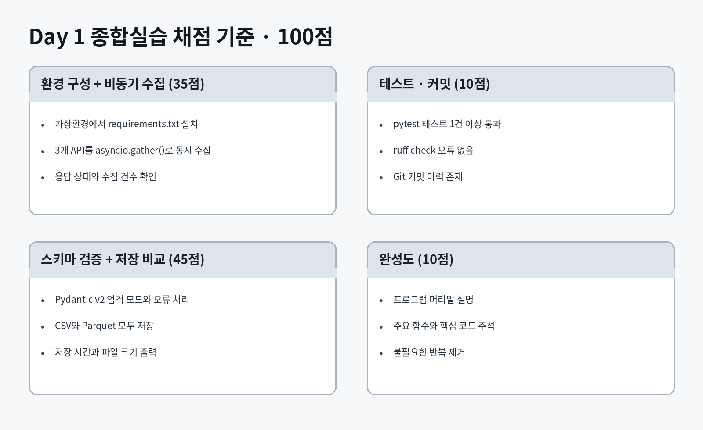
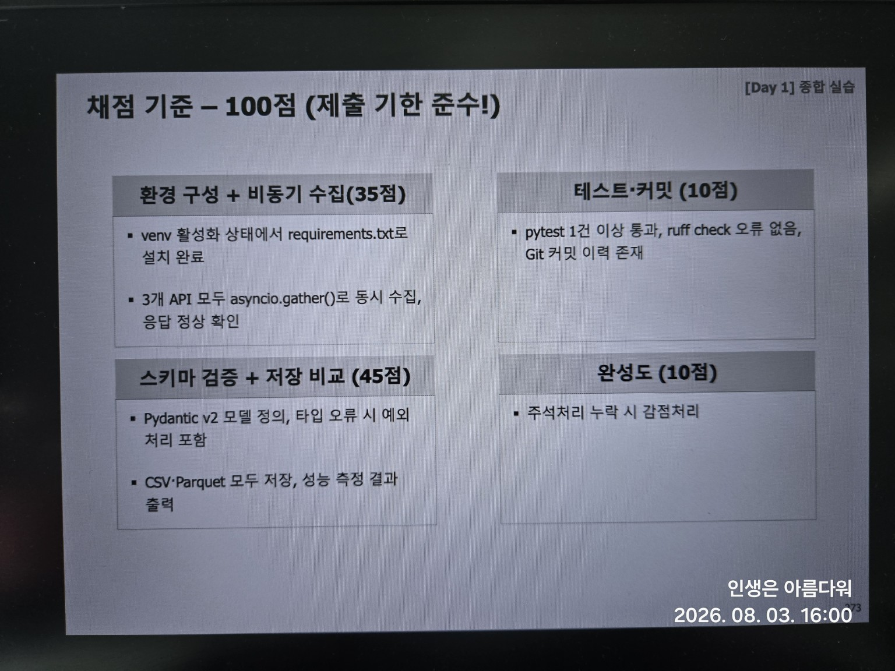
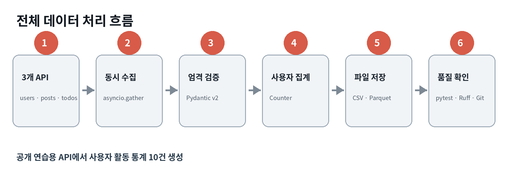
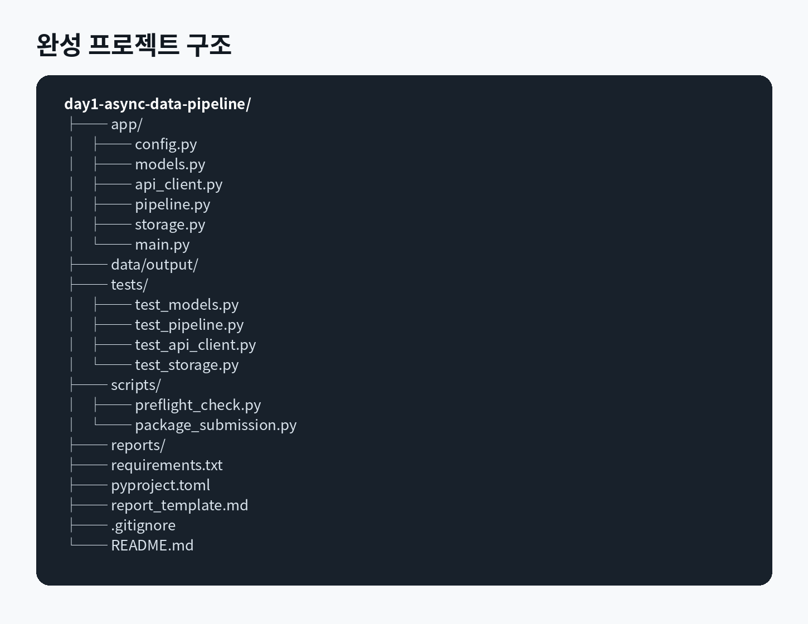
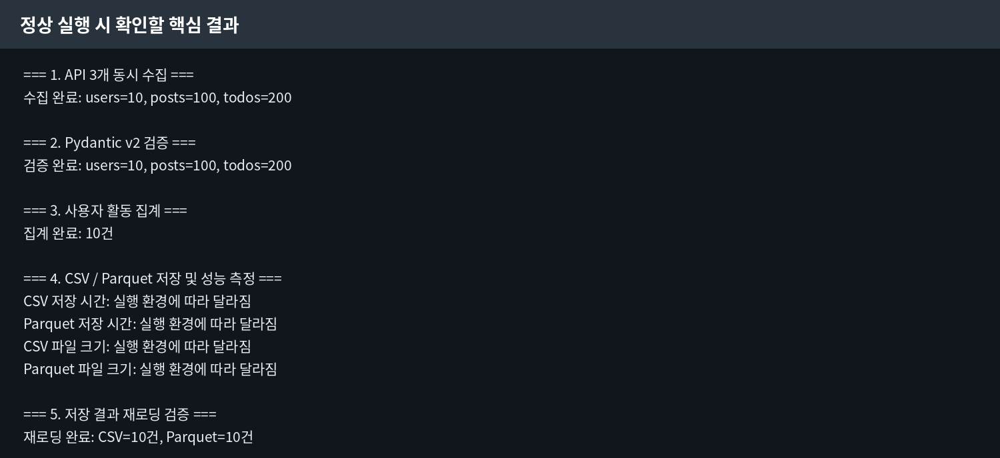
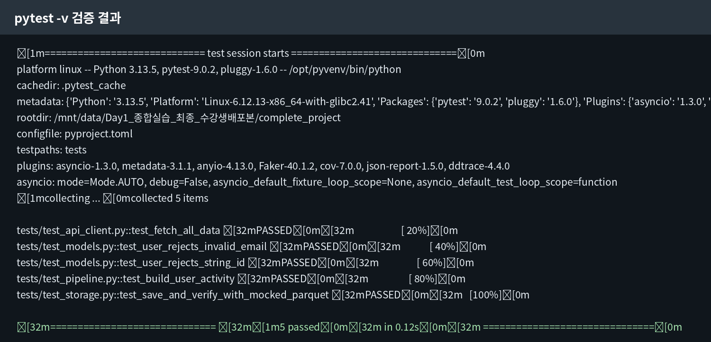
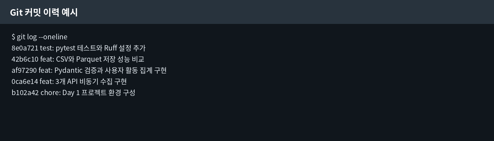
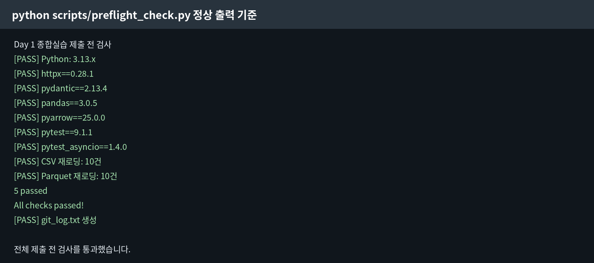
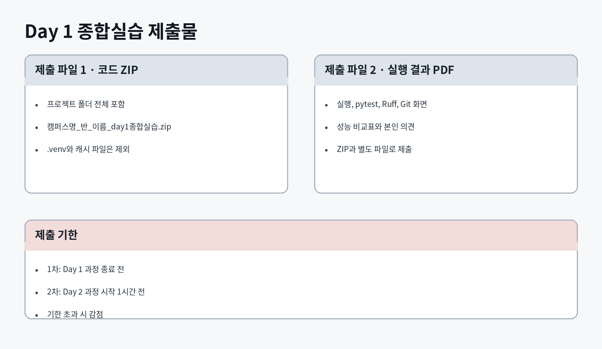
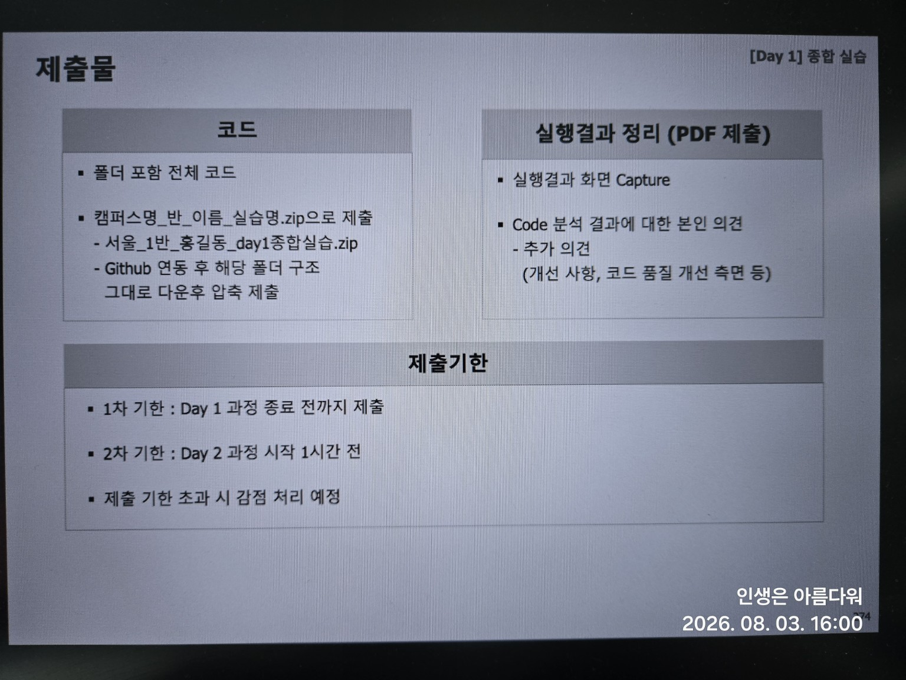

# Day 1 종합실습
## 비동기 API 수집, Pydantic 검증, CSV·Parquet 저장 파이프라인

JSONPlaceholder의 사용자, 게시물, 할 일 데이터를 동시에 수집합니다. 수집한 데이터는 Pydantic v2 엄격 모드로 검증하고 사용자별 활동 통계로 집계한 뒤 CSV와 Parquet 형식으로 저장합니다. 마지막으로 pytest, Ruff, Git으로 테스트와 코드 품질을 확인합니다.

---

## 목차

1. [실습 목표와 최종 결과](#1-실습-목표와-최종-결과)
2. [개발 환경과 프로젝트 생성](#2-개발-환경과-프로젝트-생성)
3. [프로젝트 기본 설정](#3-프로젝트-기본-설정)
4. [Pydantic 모델 작성](#4-pydantic-모델-작성)
5. [3개 API 비동기 수집](#5-3개-api-비동기-수집)
6. [데이터 검증과 사용자별 집계](#6-데이터-검증과-사용자별-집계)
7. [CSV와 Parquet 저장](#7-csv와-parquet-저장)
8. [전체 실행 코드 작성](#8-전체-실행-코드-작성)
9. [프로그램 실행과 결과 확인](#9-프로그램-실행과-결과-확인)
10. [pytest 테스트](#10-pytest-테스트)
11. [Ruff 코드 검사](#11-ruff-코드-검사)
12. [Git 커밋과 GitHub 연결](#12-git-커밋과-github-연결)
13. [실행 결과 PDF 작성](#13-실행-결과-pdf-작성)
14. [제출 전 자동 검사](#14-제출-전-자동-검사)
15. [제출 파일 만들기](#15-제출-파일-만들기)
16. [자주 발생하는 오류](#16-자주-발생하는-오류)
17. [최종 확인](#17-최종-확인)

---

# 1. 실습 목표와 최종 결과

## 1.1 실습 목표

① 가상환경을 만들고 `requirements.txt`의 패키지를 설치합니다.  
② `httpx.AsyncClient`로 REST API를 호출합니다.  
③ `asyncio.gather()`로 users, posts, todos API를 동시에 수집합니다.  
④ HTTP 오류와 네트워크 오류를 구분해 처리합니다.  
⑤ Pydantic v2 엄격 모드로 API 응답을 검증합니다.  
⑥ 잘못된 자료형과 형식의 데이터를 오류 목록으로 분리합니다.  
⑦ 사용자별 게시물 수와 할 일 완료율을 계산합니다.  
⑧ 결과를 CSV와 Parquet로 저장합니다.  
⑨ 두 파일을 다시 읽어 행 수와 사용자 번호를 비교합니다.  
⑩ 저장 시간과 파일 크기를 비교합니다.  
⑪ pytest, Ruff, Git으로 프로젝트 품질을 확인합니다.

## 1.2 채점 기준





## 1.3 최종 구현 결과

```text
users 10건 + posts 100건 + todos 200건
                ↓
        Pydantic 엄격 검증
                ↓
        사용자 활동 통계 10건
                ↓
user_activity.csv
user_activity.parquet
performance_result.json
```



## 1.4 개발 환경과 사용 버전

| 항목 | 사용 버전 |
|---|---|
| Python | CPython 3.13.x |
| 지원 운영체제 | Windows 10/11, macOS 12 이상, Linux |
| HTTPX | 0.28.1 |
| Pydantic | 2.13.4 |
| pandas | 3.0.5 |
| PyArrow | 25.0.0 |
| pytest | 9.1.1 |
| pytest-asyncio | 1.4.0 |
| Ruff | 0.16.1 |
| 개발 도구 | Visual Studio Code |
| 형상 관리 | Git |

## 1.5 필요한 의존성

```text
httpx==0.28.1
pydantic==2.13.4
pandas==3.0.5
pyarrow==25.0.0
pytest==9.1.1
pytest-asyncio==1.4.0
ruff==0.16.1
```

## 1.6 완성 프로젝트 구조



---

# 2. 개발 환경과 프로젝트 생성

## 2.1 Python 버전 확인

**Windows**

```powershell
py --version
```

**macOS 또는 Linux**

```bash
python3 --version
```

정상 실행 예시:

```text
Python 3.13.5
```

## 2.2 프로젝트 폴더 생성

**Windows PowerShell**

```powershell
mkdir day1-async-data-pipeline
cd day1-async-data-pipeline
mkdir app, tests, reports
mkdir data
mkdir data\output
```

**macOS 또는 Linux**

```bash
mkdir -p day1-async-data-pipeline/app
mkdir -p day1-async-data-pipeline/tests
mkdir -p day1-async-data-pipeline/data/output
mkdir -p day1-async-data-pipeline/reports
cd day1-async-data-pipeline
```

## 2.3 가상환경 생성

**Windows**

```powershell
py -m venv .venv
```

**macOS 또는 Linux**

```bash
python3 -m venv .venv
```

## 2.4 가상환경 활성화

**Windows PowerShell**

```powershell
.venv\Scripts\Activate.ps1
```

**Windows 명령 프롬프트**

```bat
.venv\Scripts\activate.bat
```

**macOS 또는 Linux**

```bash
source .venv/bin/activate
```

## 2.5 VS Code에서 열기

```bash
code .
```

## 2.6 인터프리터 확인

VS Code에서 `Python: Select Interpreter`를 실행하고 `.venv`를 선택합니다.

```bash
python -c "import sys; print(sys.executable)"
```

출력 경로에 `.venv`가 포함되어야 합니다.

---

# 3. 프로젝트 기본 설정

## 3.1 `requirements.txt`

**파일 경로**

```text
day1-async-data-pipeline/requirements.txt
```

```text
httpx==0.28.1
pydantic==2.13.4
pandas==3.0.5
pyarrow==25.0.0
pytest==9.1.1
pytest-asyncio==1.4.0
ruff==0.16.1
```

설치:

```bash
python -m pip install --upgrade pip
python -m pip install -r requirements.txt
```

버전 확인:

```bash
python -c "import httpx, pydantic, pandas, pyarrow; print(httpx.__version__, pydantic.__version__, pandas.__version__, pyarrow.__version__)"
```

정상 결과:

```text
0.28.1 2.13.4 3.0.5 25.0.0
```

## 3.2 `pyproject.toml`

**파일 경로**

```text
day1-async-data-pipeline/pyproject.toml
```

```toml
[tool.pytest.ini_options]
asyncio_mode = "auto"
testpaths = ["tests"]

[tool.ruff]
line-length = 88
target-version = "py313"

[tool.ruff.lint]
select = ["E", "F", "I", "B", "UP"]
```

## 3.3 `.gitignore`

**파일 경로**

```text
day1-async-data-pipeline/.gitignore
```

```gitignore
.venv/
__pycache__/
*.py[cod]
.pytest_cache/
.ruff_cache/
.DS_Store
data/output/*.csv
data/output/*.parquet
data/output/*.json
!data/output/.gitkeep
```

## 3.4 패키지 파일

**파일 경로**

```text
day1-async-data-pipeline/app/__init__.py
```

```python
"""Day 1 비동기 데이터 파이프라인 패키지."""
```

**파일 경로**

```text
day1-async-data-pipeline/tests/__init__.py
```

내용이 없는 빈 파일로 생성합니다.

---

# 4. Pydantic 모델 작성

## 4.1 핵심 개념

Pydantic은 기본 설정에서 변환 가능한 값을 목표 자료형으로 바꿀 수 있습니다. 이번 실습은 타입 오류를 명확히 확인해야 하므로 `ConfigDict(strict=True)`를 사용합니다.

## 4.2 모델 파일

**파일 경로**

```text
day1-async-data-pipeline/app/models.py
```

```python
"""API 응답과 최종 집계 결과의 Pydantic 모델입니다."""

from pydantic import BaseModel, ConfigDict, Field


class Company(BaseModel):
    """사용자 소속 회사입니다."""

    model_config = ConfigDict(strict=True)

    name: str = Field(min_length=1)


class User(BaseModel):
    """사용자 API 응답에서 실습에 필요한 필드만 검증합니다."""

    model_config = ConfigDict(strict=True)

    id: int = Field(gt=0)
    name: str = Field(min_length=1)
    email: str = Field(
        min_length=3,
        pattern=r"^[^@\s]+@[^@\s]+\.[^@\s]+$",
    )
    company: Company


class Post(BaseModel):
    """게시물 API 응답입니다."""

    model_config = ConfigDict(
        populate_by_name=True,
        strict=True,
    )

    user_id: int = Field(alias="userId", gt=0)
    id: int = Field(gt=0)
    title: str = Field(min_length=1)
    body: str = Field(min_length=1)


class Todo(BaseModel):
    """할 일 API 응답입니다."""

    model_config = ConfigDict(
        populate_by_name=True,
        strict=True,
    )

    user_id: int = Field(alias="userId", gt=0)
    id: int = Field(gt=0)
    title: str = Field(min_length=1)
    completed: bool


class UserActivity(BaseModel):
    """사용자별 게시물과 할 일 통계를 저장합니다."""

    model_config = ConfigDict(strict=True)

    user_id: int = Field(gt=0)
    name: str = Field(min_length=1)
    email: str
    company: str
    post_count: int = Field(ge=0)
    todo_count: int = Field(ge=0)
    completed_todo_count: int = Field(ge=0)
    completion_rate: float = Field(ge=0, le=100)
```

확인:

```bash
python -m py_compile app/models.py
```

오류가 출력되지 않아야 합니다.

---

# 5. 3개 API 비동기 수집

## 5.1 핵심 개념

`asyncio.gather()`는 여러 비동기 작업을 함께 실행하고 모든 결과를 기다립니다. 이번 실습에서는 하나의 `httpx.AsyncClient`를 사용해 세 API를 동시에 요청합니다.

## 5.2 API 설정

**파일 경로**

```text
day1-async-data-pipeline/app/config.py
```

```python
"""API 주소와 출력 경로를 관리합니다."""

from pathlib import Path

BASE_URL = "https://jsonplaceholder.typicode.com"
USERS_ENDPOINT = "/users"
POSTS_ENDPOINT = "/posts"
TODOS_ENDPOINT = "/todos"

PROJECT_ROOT = Path(__file__).resolve().parent.parent
OUTPUT_DIR = PROJECT_ROOT / "data" / "output"
CSV_OUTPUT = OUTPUT_DIR / "user_activity.csv"
PARQUET_OUTPUT = OUTPUT_DIR / "user_activity.parquet"
PERFORMANCE_OUTPUT = OUTPUT_DIR / "performance_result.json"
VALIDATION_ERROR_OUTPUT = OUTPUT_DIR / "validation_errors.json"
```

## 5.3 API 클라이언트

**파일 경로**

```text
day1-async-data-pipeline/app/api_client.py
```

```python
"""HTTPX로 3개 API를 비동기로 수집합니다."""

import asyncio
from typing import Any

import httpx

from app.config import POSTS_ENDPOINT, TODOS_ENDPOINT, USERS_ENDPOINT


class ApiFetchError(RuntimeError):
    """API 요청이나 응답 형식에 문제가 있을 때 발생합니다."""


async def fetch_json(
    client: httpx.AsyncClient,
    endpoint: str,
) -> list[dict[str, Any]]:
    """한 개 API를 호출하고 JSON 배열을 반환합니다."""
    try:
        response = await client.get(endpoint)
        response.raise_for_status()
        data = response.json()
    except httpx.HTTPStatusError as exc:
        raise ApiFetchError(
            f"HTTP 오류: {exc.response.status_code} {endpoint}"
        ) from exc
    except httpx.RequestError as exc:
        raise ApiFetchError(f"네트워크 오류: {endpoint} - {exc}") from exc
    except ValueError as exc:
        raise ApiFetchError(f"JSON 변환 오류: {endpoint}") from exc

    if not isinstance(data, list):
        raise ApiFetchError(f"예상하지 못한 응답 형식: {endpoint}")

    return data


async def fetch_all_data(
    client: httpx.AsyncClient,
) -> dict[str, list[dict[str, Any]]]:
    """users, posts, todos API를 동시에 요청합니다."""
    users, posts, todos = await asyncio.gather(
        fetch_json(client, USERS_ENDPOINT),
        fetch_json(client, POSTS_ENDPOINT),
        fetch_json(client, TODOS_ENDPOINT),
    )

    return {
        "users": users,
        "posts": posts,
        "todos": todos,
    }
```

확인:

```bash
python -m py_compile app/config.py app/api_client.py
```

---

# 6. 데이터 검증과 사용자별 집계

## 6.1 처리 내용

- 정상 데이터와 검증 오류 분리
- 사용자별 게시물 수 계산
- 전체 할 일 수와 완료 건수 계산
- 완료율 계산

```text
완료율 = 완료 건수 ÷ 전체 할 일 수 × 100
```

## 6.2 파이프라인 파일

**파일 경로**

```text
day1-async-data-pipeline/app/pipeline.py
```

```python
"""API 응답을 검증하고 사용자별 활동 통계로 집계합니다."""

from collections import Counter
from typing import Any

from pydantic import BaseModel, ValidationError

from app.models import Post, Todo, User, UserActivity


def validate_many[ModelT: BaseModel](
    model_class: type[ModelT],
    rows: list[dict[str, Any]],
    source_name: str,
) -> tuple[list[ModelT], list[dict[str, Any]]]:
    """여러 행을 검증하고 정상 목록과 오류 목록으로 분리합니다."""
    valid: list[ModelT] = []
    errors: list[dict[str, Any]] = []

    for index, row in enumerate(rows, start=1):
        try:
            valid.append(model_class.model_validate(row))
        except ValidationError as exc:
            errors.append(
                {
                    "source": source_name,
                    "index": index,
                    "errors": exc.errors(include_url=False),
                }
            )

    return valid, errors


def build_user_activity(
    users: list[User],
    posts: list[Post],
    todos: list[Todo],
) -> list[UserActivity]:
    """사용자별 게시물 수, 할 일 수, 완료율을 계산합니다."""
    post_counts = Counter(post.user_id for post in posts)
    todo_counts = Counter(todo.user_id for todo in todos)
    completed_counts = Counter(
        todo.user_id for todo in todos if todo.completed
    )

    result: list[UserActivity] = []

    for user in users:
        todo_count = todo_counts[user.id]
        completed_count = completed_counts[user.id]
        completion_rate = (
            round(completed_count / todo_count * 100, 2)
            if todo_count
            else 0.0
        )

        result.append(
            UserActivity(
                user_id=user.id,
                name=user.name,
                email=user.email,
                company=user.company.name,
                post_count=post_counts[user.id],
                todo_count=todo_count,
                completed_todo_count=completed_count,
                completion_rate=completion_rate,
            )
        )

    return result
```

확인:

```bash
python -m py_compile app/pipeline.py
```

---

# 7. CSV와 Parquet 저장

## 7.1 핵심 개념

CSV는 텍스트 기반이며 사람이 직접 열어 보기 쉽습니다. Parquet는 열 단위 저장 형식으로 분석 도구에서 효율적으로 사용할 수 있습니다. 데이터가 적으면 Parquet의 파일 크기나 저장 시간이 더 클 수도 있습니다.

## 7.2 저장 파일

**파일 경로**

```text
day1-async-data-pipeline/app/storage.py
```

```python
"""집계 결과를 CSV와 Parquet로 저장하고 성능을 측정합니다."""

import json
from pathlib import Path
from time import perf_counter
from typing import Any

import pandas as pd

from app.models import UserActivity


def save_json(data: Any, file_path: Path) -> None:
    """딕셔너리 또는 리스트를 JSON 파일로 저장합니다."""
    file_path.parent.mkdir(parents=True, exist_ok=True)
    with file_path.open("w", encoding="utf-8") as file:
        json.dump(data, file, ensure_ascii=False, indent=2)


def save_with_performance(
    records: list[UserActivity],
    csv_path: Path,
    parquet_path: Path,
    performance_path: Path,
) -> dict[str, float | int]:
    """CSV와 Parquet 저장 시간, 파일 크기를 측정합니다."""
    csv_path.parent.mkdir(parents=True, exist_ok=True)

    dataframe = pd.DataFrame(
        [record.model_dump() for record in records]
    )

    csv_start = perf_counter()
    dataframe.to_csv(csv_path, index=False, encoding="utf-8-sig")
    csv_seconds = perf_counter() - csv_start

    parquet_start = perf_counter()
    dataframe.to_parquet(
        parquet_path,
        index=False,
        engine="pyarrow",
        compression="snappy",
    )
    parquet_seconds = perf_counter() - parquet_start

    performance: dict[str, float | int] = {
        "rows": len(dataframe),
        "csv_seconds": round(csv_seconds, 6),
        "parquet_seconds": round(parquet_seconds, 6),
        "csv_bytes": csv_path.stat().st_size,
        "parquet_bytes": parquet_path.stat().st_size,
    }

    save_json(performance, performance_path)
    return performance


def verify_saved_data(
    csv_path: Path,
    parquet_path: Path,
) -> tuple[int, int]:
    """CSV와 Parquet를 다시 읽고 행 수와 사용자 번호를 비교합니다."""
    csv_data = pd.read_csv(csv_path)
    parquet_data = pd.read_parquet(
        parquet_path,
        engine="pyarrow",
    )

    csv_rows = len(csv_data)
    parquet_rows = len(parquet_data)

    if csv_rows != parquet_rows:
        raise ValueError("CSV와 Parquet의 행 수가 다릅니다.")

    if csv_data["user_id"].tolist() != parquet_data["user_id"].tolist():
        raise ValueError("CSV와 Parquet의 사용자 번호가 다릅니다.")

    return csv_rows, parquet_rows
```

확인:

```bash
python -m py_compile app/storage.py
```

---

# 8. 전체 실행 코드 작성

**파일 경로**

```text
day1-async-data-pipeline/app/main.py
```

```python
"""Day 1 종합실습 전체 파이프라인을 실행합니다."""

import asyncio

import httpx

from app.api_client import ApiFetchError, fetch_all_data
from app.config import (
    BASE_URL,
    CSV_OUTPUT,
    PARQUET_OUTPUT,
    PERFORMANCE_OUTPUT,
    VALIDATION_ERROR_OUTPUT,
)
from app.models import Post, Todo, User
from app.pipeline import build_user_activity, validate_many
from app.storage import (
    save_json,
    save_with_performance,
    verify_saved_data,
)


async def run_pipeline() -> None:
    """수집, 검증, 집계, 저장을 순서대로 실행합니다."""
    print("=== 1. API 3개 동시 수집 ===")

    async with httpx.AsyncClient(
        base_url=BASE_URL,
        timeout=15.0,
        follow_redirects=True,
    ) as client:
        raw_data = await fetch_all_data(client)

    print(
        "수집 완료:",
        f"users={len(raw_data['users'])},",
        f"posts={len(raw_data['posts'])},",
        f"todos={len(raw_data['todos'])}",
    )

    print("\n=== 2. Pydantic v2 검증 ===")
    users, user_errors = validate_many(
        User,
        raw_data["users"],
        "users",
    )
    posts, post_errors = validate_many(
        Post,
        raw_data["posts"],
        "posts",
    )
    todos, todo_errors = validate_many(
        Todo,
        raw_data["todos"],
        "todos",
    )

    validation_errors = user_errors + post_errors + todo_errors
    if validation_errors:
        save_json(validation_errors, VALIDATION_ERROR_OUTPUT)
        raise RuntimeError(
            "검증 오류가 발생했습니다. validation_errors.json을 확인하세요."
        )

    if VALIDATION_ERROR_OUTPUT.exists():
        VALIDATION_ERROR_OUTPUT.unlink()

    print(
        "검증 완료:",
        f"users={len(users)},",
        f"posts={len(posts)},",
        f"todos={len(todos)}",
    )

    print("\n=== 3. 사용자 활동 집계 ===")
    activity = build_user_activity(users, posts, todos)
    print(f"집계 완료: {len(activity)}건")

    print("\n=== 4. CSV / Parquet 저장 및 성능 측정 ===")
    performance = save_with_performance(
        activity,
        CSV_OUTPUT,
        PARQUET_OUTPUT,
        PERFORMANCE_OUTPUT,
    )

    print(f"CSV 저장 시간: {performance['csv_seconds']}초")
    print(f"Parquet 저장 시간: {performance['parquet_seconds']}초")
    print(f"CSV 파일 크기: {performance['csv_bytes']} bytes")
    print(f"Parquet 파일 크기: {performance['parquet_bytes']} bytes")

    print("\n=== 5. 저장 결과 재로딩 검증 ===")
    csv_rows, parquet_rows = verify_saved_data(
        CSV_OUTPUT,
        PARQUET_OUTPUT,
    )
    print(f"재로딩 완료: CSV={csv_rows}건, Parquet={parquet_rows}건")

    print("\n=== 6. 완료 ===")
    print(f"CSV: {CSV_OUTPUT}")
    print(f"Parquet: {PARQUET_OUTPUT}")
    print(f"성능 결과: {PERFORMANCE_OUTPUT}")


def main() -> None:
    """예외를 사용자에게 알기 쉬운 메시지로 출력합니다."""
    try:
        asyncio.run(run_pipeline())
    except ApiFetchError as exc:
        print(f"[API 오류] {exc}")
        raise SystemExit(1) from exc
    except ImportError as exc:
        print(
            "[의존성 오류] requirements.txt를 다시 설치하세요."
        )
        raise SystemExit(1) from exc
    except (OSError, RuntimeError, ValueError) as exc:
        print(f"[실행 오류] {exc}")
        raise SystemExit(1) from exc


if __name__ == "__main__":
    main()
```

전체 구문 검사:

```bash
python -m compileall app
```

---

# 9. 프로그램 실행과 결과 확인

## 9.1 실행

프로젝트 루트에서 실행합니다.

```bash
python -m app.main
```

인터넷 연결이 필요합니다.

## 9.2 정상 실행 확인



다음 결과가 일치해야 합니다.

```text
users=10, posts=100, todos=200
집계 완료: 10건
재로딩 완료: CSV=10건, Parquet=10건
```

저장 시간과 파일 크기는 실행 환경에 따라 달라집니다.

## 9.3 결과 파일

```text
data/output/user_activity.csv
data/output/user_activity.parquet
data/output/performance_result.json
```

CSV 확인:

```bash
python -c "import pandas as pd; print(pd.read_csv('data/output/user_activity.csv').head())"
```

Parquet 확인:

```bash
python -c "import pandas as pd; print(pd.read_parquet('data/output/user_activity.parquet').head())"
```

성능 결과 확인:

```bash
python -m json.tool data/output/performance_result.json
```

---

# 10. pytest 테스트

## 10.1 모델 테스트

**파일 경로**

```text
day1-async-data-pipeline/tests/test_models.py
```

```python
"""Pydantic 모델 검증 테스트입니다."""

import pytest
from pydantic import ValidationError

from app.models import User


def test_user_rejects_invalid_email() -> None:
    """이메일 형식이 잘못되면 ValidationError가 발생합니다."""
    raw_user = {
        "id": 1,
        "name": "홍길동",
        "email": "wrong-email",
        "company": {"name": "Example"},
    }

    with pytest.raises(ValidationError):
        User.model_validate(raw_user)


def test_user_rejects_string_id() -> None:
    """엄격 모드에서는 문자열 ID를 정수로 자동 변환하지 않습니다."""
    raw_user = {
        "id": "1",
        "name": "홍길동",
        "email": "hong@example.com",
        "company": {"name": "Example"},
    }

    with pytest.raises(ValidationError):
        User.model_validate(raw_user)
```

## 10.2 집계 테스트

**파일 경로**

```text
day1-async-data-pipeline/tests/test_pipeline.py
```

```python
"""사용자 활동 집계 테스트입니다."""

from app.models import Company, Post, Todo, User
from app.pipeline import build_user_activity


def test_build_user_activity() -> None:
    """게시물 수와 할 일 완료율을 정확히 계산합니다."""
    users = [
        User(
            id=1,
            name="홍길동",
            email="hong@example.com",
            company=Company(name="Example"),
        )
    ]
    posts = [
        Post(userId=1, id=1, title="A", body="본문"),
        Post(userId=1, id=2, title="B", body="본문"),
    ]
    todos = [
        Todo(userId=1, id=1, title="할 일 1", completed=True),
        Todo(userId=1, id=2, title="할 일 2", completed=True),
        Todo(userId=1, id=3, title="할 일 3", completed=False),
    ]

    result = build_user_activity(users, posts, todos)

    assert result[0].post_count == 2
    assert result[0].todo_count == 3
    assert result[0].completed_todo_count == 2
    assert result[0].completion_rate == 66.67
```

## 10.3 비동기 API 테스트

**파일 경로**

```text
day1-async-data-pipeline/tests/test_api_client.py
```

```python
"""실제 인터넷을 사용하지 않는 비동기 API 테스트입니다."""

import httpx
import pytest

from app.api_client import fetch_all_data
from app.config import BASE_URL


@pytest.mark.asyncio
async def test_fetch_all_data() -> None:
    """users, posts, todos 경로를 모두 호출하는지 확인합니다."""
    payloads = {
        "/users": [{"id": 1}],
        "/posts": [{"id": 1}],
        "/todos": [{"id": 1}],
    }
    called_paths: list[str] = []

    def handler(request: httpx.Request) -> httpx.Response:
        called_paths.append(request.url.path)
        return httpx.Response(
            status_code=200,
            json=payloads[request.url.path],
        )

    transport = httpx.MockTransport(handler)

    async with httpx.AsyncClient(
        base_url=BASE_URL,
        transport=transport,
    ) as client:
        result = await fetch_all_data(client)

    assert set(called_paths) == {"/users", "/posts", "/todos"}
    assert result["users"] == [{"id": 1}]
    assert result["posts"] == [{"id": 1}]
    assert result["todos"] == [{"id": 1}]
```

## 10.4 저장 연결 테스트

**파일 경로**

```text
day1-async-data-pipeline/tests/test_storage.py
```

```python
"""저장과 재로딩 검증 로직 테스트입니다."""

from pathlib import Path

import pandas as pd

from app.models import UserActivity
from app.storage import save_with_performance, verify_saved_data


def test_save_and_verify_with_mocked_parquet(
    tmp_path: Path,
    monkeypatch,
) -> None:
    """PyArrow 없이도 저장 함수의 연결 관계를 검사합니다."""
    records = [
        UserActivity(
            user_id=1,
            name="홍길동",
            email="hong@example.com",
            company="Example",
            post_count=2,
            todo_count=3,
            completed_todo_count=2,
            completion_rate=66.67,
        )
    ]

    csv_path = tmp_path / "result.csv"
    parquet_path = tmp_path / "result.parquet"
    performance_path = tmp_path / "performance.json"

    def fake_to_parquet(
        dataframe,
        path,
        **kwargs,
    ) -> None:
        dataframe.to_json(path, orient="records", force_ascii=False)

    def fake_read_parquet(
        path,
        **kwargs,
    ):
        return pd.read_json(path)

    monkeypatch.setattr(pd.DataFrame, "to_parquet", fake_to_parquet)
    monkeypatch.setattr(pd, "read_parquet", fake_read_parquet)

    performance = save_with_performance(
        records,
        csv_path,
        parquet_path,
        performance_path,
    )
    csv_rows, parquet_rows = verify_saved_data(
        csv_path,
        parquet_path,
    )

    assert performance["rows"] == 1
    assert csv_rows == 1
    assert parquet_rows == 1
    assert performance_path.exists()
```

## 10.5 테스트 실행

```bash
pytest -v
```



마지막에 다음 결과가 출력되어야 합니다.

```text
5 passed
```

---

# 11. Ruff 코드 검사

```bash
ruff check .
```


정상 결과:

```text
All checks passed!
```

자동 수정 가능한 문제:

```bash
ruff check . --fix
ruff check .
pytest -v
```

---

# 12. Git 커밋과 GitHub 연결

## 12.1 사용자 정보 확인

```bash
git config user.name
git config user.email
```

값이 없으면 설정합니다.

```bash
git config --global user.name "홍길동"
git config --global user.email "hong@example.com"
```

## 12.2 저장소와 첫 커밋

```bash
git init
git add .
git commit -m "chore: Day 1 프로젝트 환경 구성"
```

## 12.3 단계별 커밋

```bash
git add .
git commit -m "feat: 3개 API 비동기 수집 구현"
```

```bash
git add .
git commit -m "feat: Pydantic 검증과 사용자 활동 집계 구현"
```

```bash
git add .
git commit -m "feat: CSV와 Parquet 저장 성능 비교"
```

```bash
git add .
git commit -m "test: pytest 테스트와 Ruff 설정 추가"
```

## 12.4 이력 확인

```bash
git log --oneline
```



## 12.5 GitHub 연결

```bash
git branch -M main
git remote add origin https://github.com/사용자명/저장소명.git
git push -u origin main
```

---

# 13. 실행 결과 PDF 작성

## 13.1 템플릿 파일 생성

**파일 경로**

```text
day1-async-data-pipeline/report_template.md
```

```markdown
# Day 1 종합실습 실행 결과 보고서

## 1. 프로젝트 개요

- 프로젝트명:
- 작성자:
- 캠퍼스 / 반:
- 구현 목적:

## 2. 실행 환경

| 항목 | 내용 |
|---|---|
| 운영체제 |  |
| Python |  |
| 주요 패키지 |  |

## 3. 프로그램 실행 결과

다음 화면을 캡처하여 삽입합니다.

- API 3개 수집 결과
- Pydantic 검증 결과
- CSV와 Parquet 저장 결과
- 저장 결과 재로딩 검증
- 성능 측정 결과

## 4. 테스트와 코드 품질

다음 화면을 캡처하여 삽입합니다.

- `pytest -v`
- `ruff check .`
- `git log --oneline`

## 5. CSV와 Parquet 비교

| 형식 | 저장 시간 | 파일 크기 | 의견 |
|---|---:|---:|---|
| CSV |  |  |  |
| Parquet |  |  |  |

## 6. 본인 의견

- 구현하며 어려웠던 점:
- 비동기 수집의 장점:
- CSV와 Parquet 비교 결과:
- 개선할 사항:
- 코드 품질을 높이기 위한 제안:
```

## 13.2 PDF 저장 위치

완성한 PDF는 프로젝트에도 보관합니다.

```text
reports/캠퍼스명_반_이름_day1종합실습_실행결과.pdf
```

PDF에는 다음 내용을 포함합니다.

① 프로그램 실행 화면  
② CSV와 Parquet 결과 화면  
③ 저장 시간과 파일 크기 비교  
④ `pytest -v` 결과  
⑤ `ruff check .` 결과  
⑥ `git log --oneline` 결과  
⑦ 본인 의견과 개선 사항  

---

# 14. 제출 전 자동 검사

## 14.1 검사 스크립트 작성

패키지 버전, 결과 파일, pytest, Ruff, Git 이력을 한 번에 검사합니다.

**파일 경로**

```text
day1-async-data-pipeline/scripts/preflight_check.py
```

**전체 코드**

```python
"""제출 전 환경, 실행 결과, 테스트, Ruff, Git 이력을 검사합니다."""

from __future__ import annotations

import importlib
import json
import shutil
import subprocess
import sys
from pathlib import Path

import pandas as pd


PROJECT_ROOT = Path(__file__).resolve().parent.parent
OUTPUT_DIR = PROJECT_ROOT / "data" / "output"
CSV_FILE = OUTPUT_DIR / "user_activity.csv"
PARQUET_FILE = OUTPUT_DIR / "user_activity.parquet"
PERFORMANCE_FILE = OUTPUT_DIR / "performance_result.json"
GIT_LOG_FILE = PROJECT_ROOT / "git_log.txt"

EXPECTED_VERSIONS = {
    "httpx": "0.28.1",
    "pydantic": "2.13.4",
    "pandas": "3.0.5",
    "pyarrow": "25.0.0",
    "pytest": "9.1.1",
    "pytest_asyncio": "1.4.0",
}


def run_command(command: list[str], title: str) -> str:
    """명령을 실행하고 실패하면 검사 과정을 중단합니다."""
    print(f"\n=== {title} ===")
    result = subprocess.run(
        command,
        cwd=PROJECT_ROOT,
        text=True,
        capture_output=True,
        check=False,
    )

    if result.stdout:
        print(result.stdout.rstrip())
    if result.stderr:
        print(result.stderr.rstrip())

    if result.returncode != 0:
        raise RuntimeError(
            f"{title} 실패: 종료 코드 {result.returncode}"
        )

    return result.stdout


def check_python_version() -> None:
    """Python 3.13 계열인지 확인합니다."""
    version = sys.version_info
    if (version.major, version.minor) != (3, 13):
        raise RuntimeError(
            "Python 3.13 계열이 필요합니다. "
            f"현재 버전: {version.major}.{version.minor}.{version.micro}"
        )

    print(
        "[PASS] Python:",
        f"{version.major}.{version.minor}.{version.micro}",
    )


def check_package_versions() -> None:
    """requirements.txt에 고정한 패키지 버전을 확인합니다."""
    for module_name, expected in EXPECTED_VERSIONS.items():
        module = importlib.import_module(module_name)
        actual = getattr(module, "__version__", None)

        if actual != expected:
            raise RuntimeError(
                f"{module_name} 버전 불일치: "
                f"기대 {expected}, 실제 {actual}"
            )

        print(f"[PASS] {module_name}=={actual}")


def check_output_files() -> None:
    """CSV, Parquet, 성능 결과 JSON을 검사합니다."""
    required_files = [
        CSV_FILE,
        PARQUET_FILE,
        PERFORMANCE_FILE,
    ]

    missing = [
        str(path.relative_to(PROJECT_ROOT))
        for path in required_files
        if not path.exists()
    ]
    if missing:
        raise RuntimeError(
            "프로그램 실행 결과 파일이 없습니다: "
            + ", ".join(missing)
        )

    csv_data = pd.read_csv(CSV_FILE)
    parquet_data = pd.read_parquet(
        PARQUET_FILE,
        engine="pyarrow",
    )

    if len(csv_data) != 10 or len(parquet_data) != 10:
        raise RuntimeError(
            "CSV와 Parquet는 각각 10건이어야 합니다."
        )

    if csv_data["user_id"].tolist() != parquet_data["user_id"].tolist():
        raise RuntimeError(
            "CSV와 Parquet의 user_id 값이 일치하지 않습니다."
        )

    with PERFORMANCE_FILE.open("r", encoding="utf-8") as file:
        performance = json.load(file)

    required_keys = {
        "rows",
        "csv_seconds",
        "parquet_seconds",
        "csv_bytes",
        "parquet_bytes",
    }
    if not required_keys.issubset(performance):
        raise RuntimeError(
            "performance_result.json의 필수 항목이 누락되었습니다."
        )

    if performance["rows"] != 10:
        raise RuntimeError(
            "performance_result.json의 rows는 10이어야 합니다."
        )

    print("[PASS] CSV 재로딩: 10건")
    print("[PASS] Parquet 재로딩: 10건")
    print("[PASS] CSV와 Parquet user_id 일치")
    print("[PASS] 성능 결과 JSON 구조 확인")


def check_ruff() -> None:
    """설치된 Ruff로 프로젝트 전체를 검사합니다."""
    ruff_path = shutil.which("ruff")
    if ruff_path:
        command = [ruff_path, "check", "."]
    else:
        command = [sys.executable, "-m", "ruff", "check", "."]

    run_command(command, "Ruff 코드 검사")


def check_git_history() -> None:
    """커밋 이력을 확인하고 git_log.txt로 저장합니다."""
    if not (PROJECT_ROOT / ".git").exists():
        raise RuntimeError(
            "Git 저장소가 없습니다. git init과 commit을 먼저 실행하세요."
        )

    log_output = run_command(
        ["git", "log", "--oneline"],
        "Git 커밋 이력",
    ).strip()

    if not log_output:
        raise RuntimeError("Git 커밋 이력이 없습니다.")

    GIT_LOG_FILE.write_text(
        log_output + "\n",
        encoding="utf-8",
    )
    print("[PASS] git_log.txt 생성")


def main() -> None:
    """제출 전에 필요한 검사를 순서대로 실행합니다."""
    print("Day 1 종합실습 제출 전 검사")

    check_python_version()
    check_package_versions()
    check_output_files()

    run_command(
        [sys.executable, "-m", "pytest", "-v"],
        "pytest 자동 테스트",
    )
    check_ruff()
    check_git_history()

    print("\n전체 제출 전 검사를 통과했습니다.")


if __name__ == "__main__":
    try:
        main()
    except (ImportError, OSError, RuntimeError) as exc:
        print(f"\n[FAIL] {exc}")
        raise SystemExit(1) from exc
```

## 14.2 검사 실행

프로젝트 루트에서 실행합니다.

```bash
python scripts/preflight_check.py
```



마지막에 다음 문장이 출력되어야 합니다.

```text
전체 제출 전 검사를 통과했습니다.
```

검사 과정에서 Git 커밋 이력을 `git_log.txt`로 저장합니다.

---

# 15. 제출 파일 만들기





## 15.1 제출 파일

**제출 파일 1**

```text
캠퍼스명_반_이름_day1종합실습.zip
```

**제출 파일 2**

```text
캠퍼스명_반_이름_day1종합실습_실행결과.pdf
```

PDF는 다음 경로에도 저장합니다.

```text
reports/캠퍼스명_반_이름_day1종합실습_실행결과.pdf
```

## 15.2 ZIP 생성 스크립트 작성

운영체제에 관계없이 같은 방식으로 ZIP을 생성합니다. `.git`과 `git_log.txt`는 포함하고 `.venv`, 캐시 폴더, `.pyc` 파일은 제외합니다.

**파일 경로**

```text
day1-async-data-pipeline/scripts/package_submission.py
```

**전체 코드**

```python
"""프로젝트 제출용 ZIP을 운영체제와 관계없이 생성합니다."""

from __future__ import annotations

import argparse
import subprocess
import sys
import zipfile
from pathlib import Path


PROJECT_ROOT = Path(__file__).resolve().parent.parent
EXCLUDED_NAMES = {
    ".venv",
    "__pycache__",
    ".pytest_cache",
    ".ruff_cache",
    ".DS_Store",
}
EXCLUDED_SUFFIXES = {
    ".pyc",
    ".pyo",
}


def should_exclude(path: Path) -> bool:
    """가상환경, 캐시, 기존 ZIP 파일을 압축에서 제외합니다."""
    relative = path.relative_to(PROJECT_ROOT)

    if any(part in EXCLUDED_NAMES for part in relative.parts):
        return True

    if path.suffix in EXCLUDED_SUFFIXES:
        return True

    return path.suffix == ".zip"


def verify_required_files() -> None:
    """실행 결과, Git 이력, PDF 보고서를 확인합니다."""
    required = [
        PROJECT_ROOT / "data" / "output" / "user_activity.csv",
        PROJECT_ROOT / "data" / "output" / "user_activity.parquet",
        PROJECT_ROOT / "data" / "output" / "performance_result.json",
        PROJECT_ROOT / "git_log.txt",
    ]

    missing = [
        str(path.relative_to(PROJECT_ROOT))
        for path in required
        if not path.exists()
    ]
    if missing:
        raise RuntimeError(
            "제출 필수 파일이 없습니다: " + ", ".join(missing)
        )

    pdf_files = list(
        (PROJECT_ROOT / "reports").glob("*.pdf")
    )
    if not pdf_files:
        raise RuntimeError(
            "reports 폴더에 실행 결과 PDF가 없습니다."
        )

    if not (PROJECT_ROOT / ".git").exists():
        raise RuntimeError(
            ".git 폴더가 없습니다. Git 커밋을 먼저 생성하세요."
        )


def create_archive(output_path: Path) -> None:
    """프로젝트 최상위 폴더를 포함해 ZIP을 생성합니다."""
    output_path.parent.mkdir(parents=True, exist_ok=True)

    if output_path.exists():
        output_path.unlink()

    root_name = PROJECT_ROOT.name

    with zipfile.ZipFile(
        output_path,
        mode="w",
        compression=zipfile.ZIP_DEFLATED,
    ) as archive:
        for path in sorted(PROJECT_ROOT.rglob("*")):
            if not path.is_file() or should_exclude(path):
                continue

            archive_name = Path(root_name) / path.relative_to(PROJECT_ROOT)
            archive.write(path, archive_name)

    print(f"[PASS] ZIP 생성: {output_path}")
    print(f"[PASS] ZIP 크기: {output_path.stat().st_size} bytes")


def main() -> None:
    """제출 전 검사 후 지정한 이름으로 ZIP을 생성합니다."""
    parser = argparse.ArgumentParser(
        description="Day 1 종합실습 제출 ZIP 생성",
    )
    parser.add_argument(
        "output_name",
        help="예: 서울_1반_홍길동_day1종합실습.zip",
    )
    args = parser.parse_args()

    output_name = args.output_name
    if not output_name.lower().endswith(".zip"):
        raise SystemExit("출력 파일명은 .zip으로 끝나야 합니다.")

    subprocess.run(
        [sys.executable, "scripts/preflight_check.py"],
        cwd=PROJECT_ROOT,
        check=True,
    )

    verify_required_files()

    output_path = PROJECT_ROOT.parent / output_name
    create_archive(output_path)


if __name__ == "__main__":
    try:
        main()
    except (OSError, RuntimeError, subprocess.CalledProcessError) as exc:
        print(f"[FAIL] {exc}")
        raise SystemExit(1) from exc
```

## 15.3 제출 ZIP 생성

프로젝트 루트에서 실행합니다.

```bash
python scripts/package_submission.py 서울_1반_홍길동_day1종합실습.zip
```

ZIP 파일은 프로젝트 상위 폴더에 생성됩니다. 실행 과정에서 제출 전 검사를 다시 수행하므로 검사에 실패하면 ZIP을 생성하지 않습니다.

---

# 16. 자주 발생하는 오류

## 16.1 패키지를 찾을 수 없음

```text
ModuleNotFoundError
```

```bash
python -m pip install -r requirements.txt
```

## 16.2 네트워크 오류

브라우저에서 다음 주소를 확인합니다.

```text
https://jsonplaceholder.typicode.com/users
```

## 16.3 PyArrow 설치 오류

PyArrow 25.0.0은 Python 3.13용 Windows, macOS, Linux 휠을 제공합니다. macOS에서는 12 이상을 사용합니다.

```bash
python -m pip install pyarrow==25.0.0
```

## 16.4 검증 오류

```text
data/output/validation_errors.json
```

## 16.5 Ruff 오류

```bash
ruff check . --fix
ruff check .
```

## 16.6 Git 커밋 오류

```bash
git config --global user.name "홍길동"
git config --global user.email "hong@example.com"
```

## 16.7 PDF 누락 오류

제출 ZIP 생성 전에 다음 위치에 PDF가 있는지 확인합니다.

```text
reports/캠퍼스명_반_이름_day1종합실습_실행결과.pdf
```

---

# 17. 최종 확인

다음 명령을 순서대로 실행합니다.

```bash
python -m app.main
python scripts/preflight_check.py
python scripts/package_submission.py 서울_1반_홍길동_day1종합실습.zip
```

다음 결과를 확인합니다.

```text
users=10, posts=100, todos=200
집계 완료: 10건
재로딩 완료: CSV=10건, Parquet=10건
5 passed
All checks passed!
git_log.txt 생성
제출 ZIP 생성
```

최종 제출 파일:

```text
캠퍼스명_반_이름_day1종합실습.zip
캠퍼스명_반_이름_day1종합실습_실행결과.pdf
```

---

# 참고 자료

- Python `asyncio.gather`: https://docs.python.org/3/library/asyncio-task.html
- HTTPX 비동기 지원: https://www.python-httpx.org/async/
- Pydantic 엄격 모드: https://docs.pydantic.dev/latest/concepts/strict_mode/
- pandas Parquet 저장: https://pandas.pydata.org/docs/reference/api/pandas.DataFrame.to_parquet.html
- pytest: https://docs.pytest.org/en/stable/getting-started.html
- Ruff: https://docs.astral.sh/ruff/
- JSONPlaceholder: https://jsonplaceholder.typicode.com/
- Git 튜토리얼: https://git-scm.com/docs/gittutorial
- PyArrow 25.0.0: https://pypi.org/project/pyarrow/25.0.0/
- Ruff 0.16.1: https://pypi.org/project/ruff/0.16.1/
